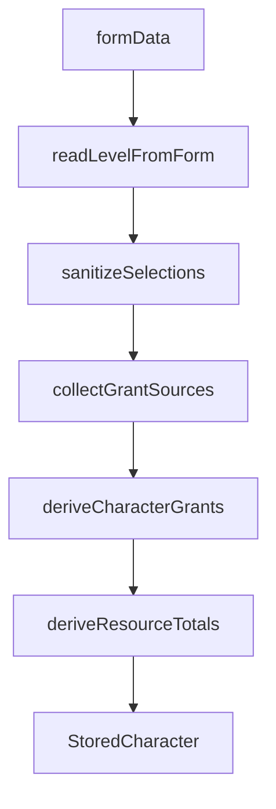

# Project Context

## Overview

RPV is a platform for **creating and consuming tabletop-RPG content**. Users build characters from declarative content (classes, subclasses, races, items, …) authored as data. The engine is **system-agnostic**; D&D 5e (SRD/Open5e) is the first pluggable content set.

See [`AGENTS.md`](AGENTS.md) for non-negotiable design principles.

---

## Character build pipeline



1. **Form** — player create/edit pages collect race, class, subclass, level, grant picks.
2. **`readLevelFromForm`** — reads `systemData.level`, coerces, floors, clamps **1–20** (default 1).
3. **`sanitizeSelections`** — clears invalid subclass (wrong class or below `subclassLevel`), then prunes stale `grantPicks`.
4. **`collectGrantSources`** — gathers `Grant[]` blocks from race, subrace, class, subclass (when unlocked), background, items.
5. **`deriveCharacterGrants`** — resolves grants + `grantPicks` into domain `CharacterGrant[]`.
6. **`deriveResourceTotals`** — sums `kind: "resource"` grants by `ref` into `stored.resources` (HP stays form-driven).

---

## Where data lives

| Field | Location | Notes |
|-------|----------|-------|
| `level` | `systemData.level` | Not in `CharacterSelections`; always read via `readLevelFromForm` |
| Race, class, subclass, background, items | `selections` | Slugs; normalized on load |
| Grant pick answers | `selections.choices.grantPicks` | Keys include feature level segment (see below) |
| Resolved abilities, spells, proficiencies | `grants[]` | Traceable via `source` |
| Aggregated totals (spell slots, rage, ki) | `resources` | Merged with form HP; derived from grants |
| Ability scores, AC, free text | `systemData` / `baseStats` | Preset-specific |

---

## Level progression

Classes define optional **`featuresByLevel`** in [`*.dnd.ts`](packages/content/src/curation/classGrants.dnd.ts). [`resolveLevelFeatures`](packages/content/src/grant/levelFeatures.ts) accumulates all blocks where `feature.level <= characterLevel`.

Creating a character at **level N** shows **all** pending choices from L1 through N on one screen. Each `choose > 0` grant becomes one or more picker slots.

### Grant pick keys

Format: `{sourceType}:{sourceId}:{levelSegment}:{grantType}:{grantIndex}:{slot}`

- `levelSegment` is `"base"` for class/race base grants, or the feature level (e.g. `"3"`) for level-gated blocks.
- Example: `class:fighter:base:skill_proficiency:3:0`, `class:fighter:3:skill_proficiency:0:0`.

Stale keys are dropped automatically when race, class, subclass, or level changes.

---

## Subclass rules

- **`subclassLevel`** on `ClassEntry` (default **3** for pilot classes) — minimum level for subclass grants to apply.
- **Below unlock:** subclass ignored in pipeline, select disabled in UI, value cleared when level drops.
- **At or above unlock:** subclass **required** for save validation when a class is selected.

Subclasses use **namespaced slugs** (`fighter-champion`, `wizard-evocation`) and live in [`subclassGrants.dnd.ts`](packages/content/src/curation/subclassGrants.dnd.ts).

---

## Resources

Resources (spell slots, rage uses, ki points) are **declarative deltas** per level:

```ts
{ grantType: "resource", choose: 0, ref: "spell-slots-1", amount: 2 }
```

Multiple grants with the same `ref` are **summed** at build time. Convention: kebab-case refs (`spell-slots-1`, `rage-uses`, `ki-points`).

**Passo 4 (pending):** read-only UI to display `stored.resources` on the character sheet.

---

## Authoring checklist — new class or subclass

1. Add entry to [`classGrants.dnd.ts`](packages/content/src/curation/classGrants.dnd.ts) or [`subclassGrants.dnd.ts`](packages/content/src/curation/subclassGrants.dnd.ts).
2. Set `subclassLevel` on the class if it has subclasses.
3. Define `grants` (base proficiencies, fixed abilities) and `featuresByLevel` (level-gated features, resources, spell picks).
4. Use `choose > 0` + `options` or `selectionFilter` for player choices.
5. Add pt-BR overlay in [`packages/content/data/translations/pt-BR.json`](packages/content/data/translations/pt-BR.json) under `classes` / `subclasses`.
6. Run `npm test` (packages) and `npm test -w rpv-front` (web pipeline).

No engine or UI code changes required if existing grant types suffice.

---

## Pilot content (L1–L5)

| Class | Resources | Subclass |
|-------|-----------|----------|
| Wizard | Spell slots `4/3/2/1` at L5 | `wizard-evocation` |
| Barbarian | `rage-uses` | `barbarian-berserker` |
| Monk | `ki-points` | `monk-open-hand` |
| Fighter | — (regression) | `fighter-champion` |

Wizard spell picks (pilot): 3 cantrips + 6 leveled spell choice slots at L5 (reduced from full SRD).

---

## Known limitations

- **Catalog spells:** pilot catalog has cantrips only; L1+ spell pick slots exist in data but may have empty option pools until more spells are added to the catalog.
- **Multiclass, ASI/Feat:** out of scope.
- **Legacy characters:** `normalizeStoredCharacter` coerces slugs and clears subclass when it does not match the selected class.

---

## Testing

```bash
npm test              # packages (domain + content) + web
npm run test:packages # packages only
npm run test:web      # apps/web only
```

Web tests are the primary integration coverage for the character pipeline.

---

## Next steps

- **Passo 4:** `ClassResourcesField` — read-only display of `stored.resources`.
- Expand spell catalog for wizard leveled spell picks.
- Extend class progression beyond L5 toward L20.
