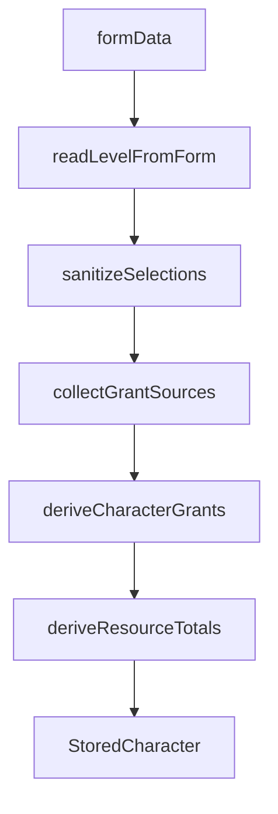

# Project Context

## Overview

RPV is a platform for **creating and consuming tabletop-RPG content**. Users build characters from declarative content (classes, subclasses, races, items, …) authored as data. The engine is **system-agnostic**; D&D 5e (SRD/Open5e) is the first pluggable content set.

See [`AGENTS.md`](AGENTS.md) for non-negotiable design principles.

---

## Character build pipeline



1. **Form** — player create/edit pages collect race, class, subclass, level, grant picks.
2. **`readLevelFromForm`** — reads `systemData.level`, coerces, floors, clamps **1–20** (default 1).
3. **`sanitizeSelections`** — clears invalid subclass (wrong class or below `subclassLevel`), then prunes stale `grantPicks`.
4. **`collectGrantSources`** — gathers `Grant[]` blocks from race, subrace, class, subclass (when unlocked), background, **equipped item slugs** (`selections.inventory.equipped`).
5. **`deriveCharacterGrants`** — resolves grants + `grantPicks` into domain `CharacterGrant[]`.
6. **`deriveResourceTotals`** — sums `kind: "resource"` grants by `ref` into `stored.resources` (HP stays form-driven).

Starting loot from class/background grants is materialized on every build via `mergeStartingGrants` (see [Starting equipment](#starting-equipment) below).

---

## Where data lives

| Field | Location | Notes |
|-------|----------|-------|
| `level` | `systemData.level` | Not in `CharacterSelections`; always read via `readLevelFromForm` |
| Inventário (possuídos) | `selections.inventory.bag` | `{ slug, quantity }[]`; sanitizado no load/build |
| Equipamento | `selections.inventory.equipped` | `slotId → slug`; só equipado gera grants/modifiers |
| Moeda concedida | `selections.grantedCurrency` | `Record<ref, amount>`; materializada de grants class/background |
| Moeda manual | `systemData.gold` / `silver` / `bronze` | Valores do jogador; não inclui `grantedCurrency` |
| Race, class, subclass, background | `selections` | Slugs; normalized on load |
| Grant pick answers | `selections.choices.grantPicks` | Keys include feature level segment (see below) |
| Resolved abilities, spells, proficiencies | `grants[]` | Traceable via `source` |
| Aggregated totals (spell slots, rage, ki) | `resources` | Merged with form HP; derived from grants |
| Ability scores, AC, free text | `systemData` / `baseStats` | Preset-specific |

Item definitions (`grants`, `allowedSlots`) live in `@rpv/content`; inventory **state** lives in `selections.inventory`.

### Inventory contract

- **Bag** does not alter stats; only **equipped** slugs feed `collectGrantSources`.
- `schemaVersion` on the `StoredCharacter` root enables future migrations.
- No `startingItem`, `items[]`, or numeric `inventory` in the persisted contract — use `selections.inventory` only.

Future HTTP contract: [`docs/API_INVENTORY.md`](docs/API_INVENTORY.md) (deferred; backend out of scope for the current frontend pilot).

---

## Level progression

Classes define optional **`featuresByLevel`** in [`*.dnd.ts`](packages/content/src/curation/classGrants.dnd.ts). [`resolveLevelFeatures`](packages/content/src/grant/levelFeatures.ts) accumulates all blocks where `feature.level <= characterLevel`.

### Creation UX (level presets)

On the **Class** step, level is set via **`CharacterLevelSelector`**: **Lv 1**, **Lv 3**, or **Custom** (numeric 1–20). Only `level` is persisted; the preset is inferred when editing.

- Class grants and pickers use `getClassGrantSourcesForLevel(class, level)` for the selected level.
- The class step shows **fixed proficiencies/resources**, **class choices** (pickers only), and a **starting equipment teaser** linking to the Equipment step (actual picks stay in `StartingEquipmentField`).
- **Ability scores:** L1 defaults to **Standard Array**; Lv > 1 defaults to **Manual** with a migration hint (valid score = **Total**). Preview hides Base when value is the default (10) and Racial when bonus is 0.

Creating a character at **level N** includes pending choices from L1 through N (scoped by the level preset). Each `choose > 0` grant becomes one or more picker slots.

### Grant pick keys

Format: `{sourceType}:{sourceId}:{levelSegment}:{grantType}:{grantIndex}:{slot}`

- `levelSegment` is `"base"` for class/race base grants, or the feature level (e.g. `"3"`) for level-gated blocks.
- Example: `class:fighter:base:skill_proficiency:3:0`, `class:fighter:3:skill_proficiency:0:0`.

Stale keys are dropped automatically when race, class, subclass, or level changes.

Exclusive starting-wealth branches use:
`{sourceType}:{sourceId}:{levelSegment}:exclusive:{exclusiveGroup}` → branch id.

---

## Subclass rules

- **`subclassLevel`** on `ClassEntry` (default **3** for pilot classes) — minimum level for subclass grants to apply.
- **Below unlock:** subclass ignored in pipeline, select disabled in UI, value cleared when level drops.
- **At or above unlock:** subclass **required** for save validation when a class is selected.

Subclasses use **namespaced slugs** (`fighter-champion`, `wizard-evocation`) and live in [`subclassGrants.dnd.ts`](packages/content/src/curation/subclassGrants.dnd.ts).

---

## Resources

Resources (spell slots, rage uses, ki points) are **declarative deltas** per level:

```ts
{ grantType: "resource", choose: 0, ref: "spell-slots-1", amount: 2 }
```

Multiple grants with the same `ref` are **summed** at build time. Convention: kebab-case refs (`spell-slots-1`, `rage-uses`, `ki-points`).

### UI

- **`deriveResourcesFromForm`** — live preview from form data (no persist).
- **`ClassResourcesField`** — create/edit form preview.
- **`DerivedResourcesDisplay`** — spell slots + class resources on the form and character card.
- **Labels** — `classResources.refs.{ref}` in [`apps/web/messages/*.json`](apps/web/messages/en.json); unknown refs fall back to a humanized slug.

HP is form-driven via `HitPointsField`. Editable combat tracking of derived resources (rage, ki, spell slots) during play is planned via the player sheet ([`docs/FICHA_JOGADOR.md`](docs/FICHA_JOGADOR.md)).

---

## Starting equipment

Class and background grants can declare starting gear and currency via `inventory_item`, `inventory_bundle`, and `currency` grant types. Resolution helpers live in `@rpv/content`; the web pipeline materializes them on every `buildStoredCharacter` / `rebuildStoredCharacter` pass.

| Grant type | Role |
|------------|------|
| `inventory_item` | Fixed or chosen items → `selections.inventory.bag` |
| `inventory_bundle` | Labeled multi-item option within a choice grant |
| `currency` | Starting wealth → `selections.grantedCurrency` |
| `exclusiveGroup` / `exclusiveBranch` | Mutually exclusive branches (e.g. equipment vs gold) |

Grants in an `exclusiveGroup` materialize only when the player picks a branch. Background grants without `exclusiveGroup` always apply.

**Provenance:** granted bag stacks may carry `ItemStack.provenance` =
`grant:{sourceType}:{sourceId}:{grantIndex}`.

**Creation UI:** `StartingEquipmentField` — exclusive branch selector, item/currency pickers, materialized bag preview. Validated via `choiceValidation` and `startingEquipmentValidation`.

**Web helpers:** [`materializeInventoryGrants.ts`](apps/web/lib/character/materializeInventoryGrants.ts), [`materializeCurrencyGrants.ts`](apps/web/lib/character/materializeCurrencyGrants.ts), [`exclusiveGroups.ts`](packages/content/src/grant/exclusiveGroups.ts).

SRD starting gear uses **multiple separate `choose: 1` grants** (armor, weapons, pack), not one multi-pick grant.

**Limitation:** if a granted item is equipped and the background changes, the equipped slot is **not** auto-cleared (equipped has no provenance).

---

## Content authoring

Detailed checklists for new classes, subclasses, items, and grant patterns live in:

- [`packages/content/AGENTS.md`](packages/content/AGENTS.md) — item authoring, starting equipment grants, pilot patterns
- [`packages/domain/AGENTS.md`](packages/domain/AGENTS.md) — engine boundaries

When adding content, run `npm run test:packages` and `npm test -w rpv-front`.

---

## Pilot content (L1–L5)

| Class | Resources | Subclass |
|-------|-----------|----------|
| Wizard | Spell slots `4/3/2/1` at L5 | `wizard-evocation` |
| Barbarian | `rage-uses` | `barbarian-berserker` |
| Monk | `ki-points` | `monk-open-hand` |
| Fighter | — (regression) | `fighter-champion` |

Wizard spell picks (pilot): 3 cantrips + 6 leveled spell choice slots at L5 (reduced from full SRD).

**Pilot items** (D&D): 6 pilot gear items + 3 `pilot-test-*` contract fixtures —
see [`itemGrants.dnd.ts`](packages/content/src/curation/itemGrants.dnd.ts).

Full SRD class/background/item catalogs are future work (Supabase-backed content).

---

## Known limitations

- **Catalog spells:** pilot catalog includes cantrips plus a wizard L1 subset (8 spells); higher-level pools remain sparse until the catalog expands.
- **Multiclass, ASI/Feat:** out of scope.
- **Variant Human** (feat vs ASI): not implemented.
- **Legacy characters:** `normalizeStoredCharacter` coerces slugs, clears invalid subclass, backfills `schemaVersion` and `selections.inventory`, and strips legacy inventory keys from `systemData`.

### ContentRepository

Read-only content access is abstracted in `@rpv/content` (`ContentRepository`,
`StaticContentRepository`, `getContentRepository`). The web app uses
`apps/web/lib/content/contentRepository.ts`. A future `SupabaseContentRepository`
will store the same `ClassEntry` / `ItemEntry` / catalog JSON shapes; grant
resolution stays in `@rpv/content` grant helpers, not in the backend.

---

## Testing

```bash
npm test              # packages (domain + content) + web
npm run test:packages # packages only
npm run test:web      # apps/web only
```

Web tests are the primary integration coverage for the character pipeline.

---

## Next steps

- **Ficha de jogador e auxiliar de rolagens** — see [docs/FICHA_JOGADOR.md](docs/FICHA_JOGADOR.md) (player sheet full-page, roll assistant, phased UX roadmap).
- Extend spell catalog beyond wizard L1 toward full SRD coverage.
- Extend class progression beyond L5 toward L20.
- Initiative tracker: editable current uses for derived resources (rage, ki) — partially addressed by player sheet header (Fases 1–2 in FICHA_JOGADOR.md).
