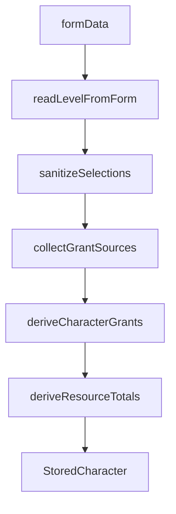

# Project Context

## Overview

RPV is a platform for **creating and consuming tabletop-RPG content**. Users build characters from declarative content (classes, subclasses, races, items, …) authored as data. The engine is **system-agnostic**; D&D 5e (SRD/Open5e) is the first pluggable content set.

See [`AGENTS.md`](AGENTS.md) for non-negotiable design principles.

---

## Character build pipeline



1. **Form** — player create/edit pages collect race, class, subclass, level, grant picks.
2. **`readLevelFromForm`** — reads `systemData.level`, coerces, floors, clamps **1–20** (default 1).
3. **`sanitizeSelections`** — clears invalid subclass (wrong class or below `subclassLevel`), then prunes stale `grantPicks`.
4. **`collectGrantSources`** — gathers `Grant[]` blocks from race, subrace, class, subclass (when unlocked), background, **equipped item slugs** (`selections.inventory.equipped`).
5. **`deriveCharacterGrants`** — resolves grants + `grantPicks` into domain `CharacterGrant[]`.
6. **`deriveResourceTotals`** — sums `kind: "resource"` grants by `ref` into `stored.resources` (HP stays form-driven).

---

## Where data lives

| Field | Location | Notes |
|-------|----------|-------|
| `level` | `systemData.level` | Not in `CharacterSelections`; always read via `readLevelFromForm` |
| Inventário (possuídos) | `selections.inventory.bag` | `{ slug, quantity }[]`; sanitizado no load/build |
| Equipamento | `selections.inventory.equipped` | `slotId → slug`; só equipado gera grants/modifiers |
| Moeda concedida | `selections.grantedCurrency` | `Record<ref, amount>`; materializada de grants class/background |
| Moeda manual | `systemData.gold` / `silver` / `bronze` | Valores do jogador; não inclui `grantedCurrency` |
| Race, class, subclass, background | `selections` | Slugs; normalized on load |
| Grant pick answers | `selections.choices.grantPicks` | Keys include feature level segment (see below) |
| Resolved abilities, spells, proficiencies | `grants[]` | Traceable via `source` |
| Aggregated totals (spell slots, rage, ki) | `resources` | Merged with form HP; derived from grants |
| Ability scores, AC, free text | `systemData` / `baseStats` | Preset-specific |

Item definitions (`grants`, `allowedSlots`) live in `@rpv/content`; inventory **state** lives in `selections.inventory`.

### Inventory contract

- **Bag** does not alter stats; only **equipped** slugs feed `collectGrantSources`.
- `schemaVersion` on the `StoredCharacter` root enables future migrations.
- No `startingItem`, `items[]`, or numeric `inventory` in the persisted contract — use `selections.inventory` only.

### API contract (deferred)

Future HTTP contract for inventory and `StoredCharacter` persistence:
[`docs/API_INVENTORY.md`](docs/API_INVENTORY.md).

- **PATCH** `/characters/:id/inventory` — full-replace `{ bag, equipped }`; server runs `sanitizeInventory` + rebuild.
- Only **equipped** slugs generate grants/modifiers (same as web).
- Backend implementation is **out of scope** for the current frontend pilot.

---

## Level progression

Classes define optional **`featuresByLevel`** in [`*.dnd.ts`](packages/content/src/curation/classGrants.dnd.ts). [`resolveLevelFeatures`](packages/content/src/grant/levelFeatures.ts) accumulates all blocks where `feature.level <= characterLevel`.

Creating a character at **level N** shows **all** pending choices from L1 through N on one screen. Each `choose > 0` grant becomes one or more picker slots.

### Grant pick keys

Format: `{sourceType}:{sourceId}:{levelSegment}:{grantType}:{grantIndex}:{slot}`

- `levelSegment` is `"base"` for class/race base grants, or the feature level (e.g. `"3"`) for level-gated blocks.
- Example: `class:fighter:base:skill_proficiency:3:0`, `class:fighter:3:skill_proficiency:0:0`.

Stale keys are dropped automatically when race, class, subclass, or level changes.

---

## Subclass rules

- **`subclassLevel`** on `ClassEntry` (default **3** for pilot classes) — minimum level for subclass grants to apply.
- **Below unlock:** subclass ignored in pipeline, select disabled in UI, value cleared when level drops.
- **At or above unlock:** subclass **required** for save validation when a class is selected.

Subclasses use **namespaced slugs** (`fighter-champion`, `wizard-evocation`) and live in [`subclassGrants.dnd.ts`](packages/content/src/curation/subclassGrants.dnd.ts).

---

## Resources

Resources (spell slots, rage uses, ki points) are **declarative deltas** per level:

```ts
{ grantType: "resource", choose: 0, ref: "spell-slots-1", amount: 2 }
```

Multiple grants with the same `ref` are **summed** at build time. Convention: kebab-case refs (`spell-slots-1`, `rage-uses`, `ki-points`).

### UI (Passo 4)

Read-only preview and sheet display share the same pipeline slice:

- **`deriveResourcesFromForm`** — `sanitizeSelections → deriveCharacterGrants → deriveResourceTotals` from live form data (no persist).
- **`ClassResourcesField`** — form create/edit preview; updates when class, level, or choices change.
- **`DerivedResourcesDisplay`** — spell slots + class resources with i18n labels; used on the form and in `CharacterCardAbilities`.
- **Labels** — `classResources.refs.{ref}` in [`apps/web/messages/*.json`](apps/web/messages/en.json); unknown refs fall back to a humanized slug.

HP remains form-driven via `HitPointsField`. Combat tracking of rage/ki uses in initiative is **not** implemented yet.

---

## Authoring checklist — new class or subclass

1. Add entry to [`classGrants.dnd.ts`](packages/content/src/curation/classGrants.dnd.ts) or [`subclassGrants.dnd.ts`](packages/content/src/curation/subclassGrants.dnd.ts).
2. Set `subclassLevel` on the class if it has subclasses.
3. Define `grants` (base proficiencies, fixed abilities) and `featuresByLevel` (level-gated features, resources, spell picks).
4. Use `choose > 0` + `options` or `selectionFilter` for player choices.
5. Add pt-BR overlay in [`packages/content/data/translations/pt-BR.json`](packages/content/data/translations/pt-BR.json) under `classes` / `subclasses`.
6. For new resource refs, add `classResources.refs.{ref}` in [`apps/web/messages/en.json`](apps/web/messages/en.json) and [`pt-BR.json`](apps/web/messages/pt-BR.json).
7. Run `npm test` (packages) and `npm test -w rpv-front` (web pipeline).

No engine or UI code changes required if existing grant types suffice.

### Racial ability score increases (`ability_score` grant)

**Fixed:** `{ grantType: "ability_score", choose: 0, targetStat, amount }` →
`abilityScoreGrantsToModifiers` in `@rpv/content`.

**Distributable:** `{ choose: N, amount: 1, options: [{ optionType: "stat", ref }] }`.
Picks live in `choices.grantPicks`; resolved via `resolveAbilityScoreGrants`.
UI: `CharacterGrantPickers` (racial ASI section) + `AbilityScoresField` (base /
racial / total columns).

**Half-elf pilot:** `dndRaceAsiOverrides` in [`raceGrants.dnd.ts`](packages/content/src/curation/raceGrants.dnd.ts)
(+2 CHA fixed, +1 to two other stats). Variant Human (feat vs ASI) is follow-up.

### Independent equipment choices + bundles

SRD starting gear uses **multiple separate `choose: 1` grants** (armor, weapons,
pack), not one multi-pick grant. Bundle options use `inventory_bundle` with a
human-readable `label`; `formatInventoryBundleLabel` falls back to item names.
Fighter pilot: see [`classGrants.dnd.ts`](packages/content/src/curation/classGrants.dnd.ts).

---

## Authoring checklist — new item

Full guide (contract, anti-patterns, pilot patterns):
[`packages/content/AGENTS.md`](packages/content/AGENTS.md) (Item authoring).

1. Add entry to [`itemGrants.dnd.ts`](packages/content/src/curation/itemGrants.dnd.ts) (`system: "dnd"`).
2. Set `allowedSlots` using IDs from [`equipmentSlots.dnd.ts`](packages/content/src/curation/equipmentSlots.dnd.ts).
3. Set `stackable` (`false` for unique gear).
4. Define `grants` with `choose: 0` (`stat_modifier`, `spell`, or `ability`).
5. Add pt-BR overlay under `items` in [`packages/content/data/translations/pt-BR.json`](packages/content/data/translations/pt-BR.json).
6. If adding a new equipment slot, update `equipmentSlots.dnd.ts` + pt-BR `equipmentSlots`.
7. Extend [`packages/content/__tests__/itemGrants.test.ts`](packages/content/__tests__/itemGrants.test.ts) for the new slug.
8. Run `npm run test:packages` and `npm test -w rpv-front`.
9. After Etapa 6 UI: smoke-test bag → equip → verify resolved stats/grants.

No engine or UI code changes required if existing grant types suffice.

### Background starting loot (`inventory_item` grant)

**Etapa 1 (content):** data contract for `inventory_item` (fixed + choices +
bundles) and `currency` grants. Resolution helpers live in `@rpv/content`
(`resolveInventoryItemGrants`, `extractCurrencyGrants`, …).

**Web today:** class + background starting loot materializes on every
`buildStoredCharacter` / `rebuildStoredCharacter` pass via `mergeStartingGrants`.
Grants in an `exclusiveGroup` materialize only when the player picks a branch
(equipment vs gold). Background grants without `exclusiveGroup` always apply.

| Field | Value |
|-------|-------|
| `grantType` | `"inventory_item"` or `"currency"` |
| `choose` | `0` fixed; `> 0` player picks |
| `ref` | Item slug (`inventory_item`) or currency unit (`currency`) |
| `amount` | Quantity (default `1` for items) |
| `exclusiveGroup` / `exclusiveBranch` | Mutually exclusive starting wealth branches |

**Exclusive pick key:** `{sourceType}:{sourceId}:{levelSegment}:exclusive:{exclusiveGroup}` → branch id.

**Provenance:** granted bag stacks carry `ItemStack.provenance` =
`grant:{sourceType}:{sourceId}:{grantIndex}` (e.g. `grant:background:sage:2`).

**Etapa 2 (web):** `mergeStartingGrants` materializa class + background
(`resolveInventoryItemGrants` + `grantPicks`) e `currency` (`resolveCurrencyGrants`)
em `selections.grantedCurrency`. Manual em `systemData.gold/silver/bronze`.
Helpers: [`materializeInventoryGrants.ts`](apps/web/lib/character/materializeInventoryGrants.ts),
[`materializeCurrencyGrants.ts`](apps/web/lib/character/materializeCurrencyGrants.ts),
[`exclusiveGroups.ts`](packages/content/src/grant/exclusiveGroups.ts).

**Etapa 3 (web):** `StartingEquipmentField` — seletor de branch exclusivo,
dropdowns de `inventory_item` / `currency` com `choose > 0`, preview da bag
materializada e breakdown de moeda. Validação em `choiceValidation` +
`startingEquipmentValidation`.

**Limitation:** if a granted item is equipped and the background changes, the
equipped slot is **not** auto-cleared (equipped has no provenance).

Pilot: Sage background grants `scroll-of-fire-bolt` + 15 gp; Fighter grants
equipment **or** 50 gp (avg 5d4×10) — see
[`backgroundGrants.dnd.ts`](packages/content/src/curation/backgroundGrants.dnd.ts),
[`classGrants.dnd.ts`](packages/content/src/curation/classGrants.dnd.ts).

---

## Pilot content (L1–L5)

| Class | Resources | Subclass |
|-------|-----------|----------|
| Wizard | Spell slots `4/3/2/1` at L5 | `wizard-evocation` |
| Barbarian | `rage-uses` | `barbarian-berserker` |
| Monk | `ki-points` | `monk-open-hand` |
| Fighter | — (regression) | `fighter-champion` |

Wizard spell picks (pilot): 3 cantrips + 6 leveled spell choice slots at L5 (reduced from full SRD).

**Pilot items** (D&D): 6 pilot gear items + 3 `pilot-test-*` contract fixtures —
see [`itemGrants.dnd.ts`](packages/content/src/curation/itemGrants.dnd.ts).

---

## Starting equipment roadmap

| Etapa | Status | Scope |
|-------|--------|-------|
| 1 — Data contract | Done | `@rpv/content`: `inventory_item` choices/bundles, `currency`, `exclusiveGroup`, resolution helpers |
| 2 — Web pipeline | Done | `mergeStartingGrants`, exclusive branch filter, `grantedCurrency` via `resolveCurrencyGrants` |
| 3 — Creation UI | Done | `StartingEquipmentField`, exclusive branch selector, equipment/currency validation |
| 4 — Content | With Supabase | SRD classes, backgrounds, item catalog |

---

## Known limitations

- **Catalog spells:** pilot catalog has cantrips only; L1+ spell pick slots exist in data but may have empty option pools until more spells are added to the catalog.
- **Multiclass, ASI/Feat:** out of scope.
- **Legacy characters:** `normalizeStoredCharacter` coerces slugs, clears invalid subclass, backfills `schemaVersion` and `selections.inventory`, and strips legacy inventory keys from `systemData`.

---

## Testing

```bash
npm test              # packages (domain + content) + web
npm run test:packages # packages only
npm run test:web      # apps/web only
```

Web tests are the primary integration coverage for the character pipeline.

---

## Next steps

- Expand spell catalog for wizard leveled spell picks.
- Extend class progression beyond L5 toward L20.
- Initiative tracker: editable current uses for derived resources (rage, ki).
