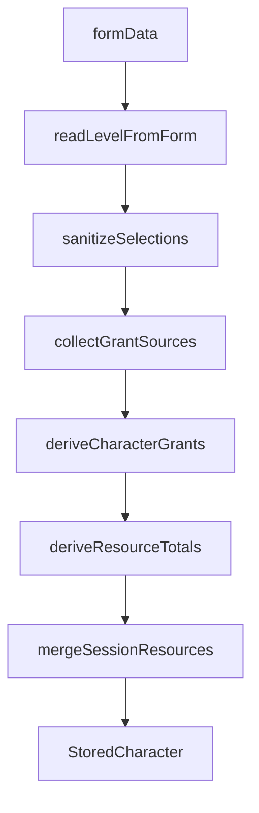

# Project Context

## Overview

RPV is a platform for **creating and consuming tabletop-RPG content**. Users build characters from declarative content (classes, subclasses, races, items, …) authored as data. The engine is **system-agnostic**; D&D 5e (SRD/Open5e) is the first pluggable content set.

See [`AGENTS.md`](AGENTS.md) for non-negotiable design principles.

---

## Character build pipeline


```mermaid
flowchart TD
  formData --> readLevel[readLevelFromForm]
  readLevel --> sanitize[sanitizeSelections]
  sanitize --> collect[collectGrantSources]
  collect --> derive[deriveCharacterGrants]
  derive --> maxima[deriveResourceTotals]
  maxima --> mergeRes[mergeSessionResources]
  mergeRes --> stored[StoredCharacter]
```

1. **Form** — player create/edit pages collect race, class, subclass, level, grant picks.
2. **`readLevelFromForm`** — reads `systemData.level`, coerces, floors, clamps **1–20** (default 1).
3. **`sanitizeSelections`** — clears invalid subclass (wrong class or below `subclassLevel`), then prunes stale `grantPicks`.
4. **`collectGrantSources`** — gathers `Grant[]` blocks from race, subrace, class, subclass (when unlocked), background, **equipped item slugs** (`selections.inventory.equipped`).
5. **`deriveCharacterGrants`** — resolves grants + `grantPicks` into domain `CharacterGrant[]`.
6. **`deriveResourceTotals`** — sums `kind: "resource"` grants by `ref` into **maxima**.
7. **`mergeSessionResources`** — writes `stored.resources` as **current** values: for each derived ref except HP, `current = clamp(existing ?? max, 0, max)`. HP is synced separately via `syncResourceHpToResolvedMax`. Rebuild / load therefore **preserves** spent slots, rage, and ki.
8. **`session`** — table-session currents (`concentratingOn`, `activeConditions`) are **not** derived. Rebuild sanitizes and keeps them, same as notes. Rest does **not** clear them. Live stats (`getResolvedStats`) pass `ResolveContext { activeConditions }` so `duration.conditional` modifiers apply; roll riders (advantage, extra dice) are not StatKeys and stay in the dice assistant.

`getResourceMax` for class pools (ki, slots, rage) also reads `deriveResourceTotals(stored.grants)` so in-play `updateResource` clamps against the rebuilt maximum.

Starting loot from class/background grants is materialized on every build via `mergeStartingGrants` (see [Starting equipment](#starting-equipment) below).

---

## Where data lives

| Field | Location | Notes |
|-------|----------|-------|
| `level` | `systemData.level` | Not in `CharacterSelections`; always read via `readLevelFromForm` |
| Inventário (possuídos) | `selections.inventory.bag` | `{ slug, quantity }[]`; sanitizado no load/build |
| Equipamento | `selections.inventory.equipped` | `slotId → slug`; só equipado gera grants/modifiers |
| Moeda concedida | `selections.grantedCurrency` | `Record<ref, amount>`; materializada de grants class/background |
| Moeda manual | `systemData.gold` / `silver` / `bronze` | Valores do jogador; não inclui `grantedCurrency` |
| Race, class, subclass, background | `selections` | Slugs; normalized on load |
| Grant pick answers | `selections.choices.grantPicks` | Keys include feature level segment (see below) |
| Resolved abilities, spells, proficiencies | `grants[]` | Traceable via `source` |
| Aggregated totals (spell slots, rage, ki) | `resources` | **Current** remaining; maxima come from grants. Rebuild preserves current (clamped). HP is form-driven + `syncResourceHpToResolvedMax`. |
| Table session (concentration, conditions) | `session` | Optional. Rebuild preserves like notes. `schemaVersion` stays **1**. |
| Ability scores, AC, free text | `systemData` / `baseStats` | Preset-specific |

Item definitions (Open5e catalog + RPV overlays) live in `@rpv/content`; inventory **state** lives in `selections.inventory`. Item `slug` values are Open5e keys (`srd_*`) or `rpv_*`.

### Inventory contract

- **Bag** does not alter stats; only **equipped** slugs feed `collectGrantSources` and armor AC.
- Equipment slots are UI containers only — any owned item may be equipped in any valid slot.
- `schemaVersion` on the `StoredCharacter` root enables future migrations.
- No `startingItem`, `items[]`, or numeric `inventory` in the persisted contract — use `selections.inventory` only.

Future HTTP contract: [`docs/API_INVENTORY.md`](docs/API_INVENTORY.md) (deferred; backend out of scope for the current frontend pilot).

---

## Level progression

Classes define optional **`featuresByLevel`** in [`*.dnd.ts`](packages/content/src/curation/classGrants.dnd.ts). [`resolveLevelFeatures`](packages/content/src/grant/levelFeatures.ts) accumulates all blocks where `feature.level <= characterLevel`.

### Creation UX

**Current implementation:** dynamic wizard via [`resolveCreationSteps`](apps/web/lib/character/creationSteps/resolveCreationSteps.ts) — selection cards (race/subrace/class/subclass/background), per-level progression, spell grids, abilities before finalize, and rich starting equipment (`ItemChoiceGrid` + exclusive branch cards). Spec and residual work: [`docs/CHARACTER_CREATION.md`](docs/CHARACTER_CREATION.md).

- Free step navigation; save allowed with incomplete picks (invalid picks still block save).
- Pending decisions deep-link with `?step=` and optional `?focus=` (grant pick key) for scroll/highlight.
- On the **Class** step, level is set via **`CharacterLevelSelector`**: **Lv 1**, **Lv 2**, **Lv 3**, or **Custom** (numeric 1–20). Only `level` is persisted.
- Class grants and pickers use `getClassGrantSourcesForLevel(class, level)` for the selected level.
- **Ability scores:** L1 defaults to **Standard Array**; Lv > 1 defaults to **Manual** with a migration hint (valid score = **Total**). Distributable racial ASI (+2/+1) is picked on the abilities step.
- Creating at **level N** walks dedicated sub-steps for L1–N (within the creation progression cap); remaining higher-level picks can be completed later via **level-up** (`?mode=level-up&from=N` → `resolveLevelUpSteps`).

### Grant pick keys

Format: `{sourceType}:{sourceId}:{levelSegment}:{grantType}:{grantIndex}:{slot}`

- `levelSegment` is `"base"` for class/race base grants, or the feature level (e.g. `"3"`) for level-gated blocks.
- Example: `class:fighter:base:skill_proficiency:3:0`, `class:fighter:3:skill_proficiency:0:0`.

Stale keys are dropped automatically when race, class, subclass, or level changes.

Exclusive starting-wealth branches use:
`{sourceType}:{sourceId}:{levelSegment}:exclusive:{exclusiveGroup}` → branch id.

---

## Subclass rules

- **`subclassLevel`** on `ClassEntry` (default **3** for pilot classes) — minimum level for subclass grants to apply.
- **Below unlock:** subclass ignored in pipeline, select disabled in UI, value cleared when level drops.
- **At or above unlock:** subclass **required** for save validation when a class is selected.

Subclasses use **namespaced slugs** (`fighter-champion`, `wizard-evocation`) and live in [`subclassGrants.dnd.ts`](packages/content/src/curation/subclassGrants.dnd.ts).

---

## Resources

Resources (spell slots, rage uses, ki points) are **declarative deltas** per level:

```ts
{ grantType: "resource", choose: 0, ref: "spell-slots-1", amount: 2 }
```

Multiple grants with the same `ref` are **summed** at build time. Convention: kebab-case refs (`spell-slots-1`, `rage-uses`, `ki-points`, `pact-slots`).

Optional resource metadata on the grant (copied to `CharacterGrant.resource`):

- `recoverOn` — `"short_rest"` | `"long_rest"` (sheet rest actions restore matching pools; omitted refs are left alone)
- `display` — `"slots"` | `"counter"` (pact and similar pools use `slots` without the `spell-slots-N` prefix)
- `slotLevel` — slot level for pact-style pools (may rise independently of `amount`)

`spell-slots-N` still means wizard-style slots in the UI. Warlock uses `ref: "pact-slots"` with `display: "slots"`.

### UI

- **`deriveResourcesFromForm`** — live preview from form data (no persist).
- **`ClassResourcesField`** — create/edit form preview.
- **`DerivedResourcesDisplay`** — spell slots + class resources on the form and character card.
- **Labels** — `classResources.refs.{ref}` in [`apps/web/messages/*.json`](apps/web/messages/en.json); unknown refs fall back to a humanized slug.

HP is class formula + resolved Constitution (race/item/class ability grants, equipped only) plus equipped `hitPoints` `stat_modifier`s. Bag items do not change HP. During play, current uses live in `stored.resources` and survive rebuilds via `mergeSessionResources`. Short/long rest (`applyRest`) restores pools by `recoverOn` and sets HP to resolved max on a long rest.

### Spellcasting modes

`ClassEntry.spellcastingMode` plus optional `preparedQuota` (`level-plus-mod` default when `spellcastingAbility` is set; `half-level-plus-mod` for half-casters):

| Mode | Prepare pool | Castable on the sheet |
|------|----------------|------------------------|
| `known` / `pact` / omitted | — | all spell grants |
| `spellbook` | known leveled grants | cantrips + `preparedSpells` |
| `prepared-list` | class list up to current max slot + fixed (`choose: 0`) spells | cantrips + prepared + domain/fixed grants |

Cleric is the prepared-list pilot. Warlock is the pact pilot (`pact-slots`, L1–3). Fighter ASI is an `ability_score` `choose` grant at class levels 4/8/12/16/19 (creation wizard still caps at level 3).

### Unarmored AC

`grantType: "armor_class_formula"` (`amount` base + `options` of `{ optionType: "stat", ref }`) is **not** a `CharacterGrant`. `computeEquippedArmorClass` uses it when no body armor is worn; shields still add. Barbarian L1: `10 + DEX + CON`; monk L1: `10 + DEX + WIS`. Equipped armor without the matching `armor_proficiency` keeps the AC number and shows a warning.

---

## Starting equipment

Class and background grants can declare starting gear and currency via `inventory_item`, `inventory_bundle`, and `currency` grant types. Resolution helpers live in `@rpv/content`; the web pipeline materializes them on every `buildStoredCharacter` / `rebuildStoredCharacter` pass.

| Grant type | Role |
|------------|------|
| `inventory_item` | Fixed or chosen items → `selections.inventory.bag` |
| `inventory_bundle` | Labeled multi-item option within a choice grant |
| `currency` | Starting wealth → `selections.grantedCurrency` |
| `exclusiveGroup` / `exclusiveBranch` | Mutually exclusive branches (e.g. equipment vs gold) |

Grants in an `exclusiveGroup` materialize only when the player picks a branch. Background grants without `exclusiveGroup` always apply.

**Provenance:** granted bag stacks may carry `ItemStack.provenance` =
`grant:{sourceType}:{sourceId}:{grantIndex}`.

**Creation UI:** `StartingEquipmentField` — exclusive branch cards, `ItemChoiceGrid` for inventory/bundles, currency `<select>` when needed, bag/currency preview. Validated via `choiceValidation` and `startingEquipmentValidation`.

**Web helpers:** [`materializeInventoryGrants.ts`](apps/web/lib/character/materializeInventoryGrants.ts), [`materializeCurrencyGrants.ts`](apps/web/lib/character/materializeCurrencyGrants.ts), [`exclusiveGroups.ts`](packages/content/src/grant/exclusiveGroups.ts).

SRD starting gear uses **multiple separate `choose: 1` grants** (armor, weapons, pack), not one multi-pick grant.

**Limitation:** if a granted item is equipped and the background changes, the equipped slot is **not** auto-cleared (equipped has no provenance).

---

## Content authoring

Detailed checklists for new classes, subclasses, items, and grant patterns live in:

- [`packages/content/AGENTS.md`](packages/content/AGENTS.md) — item authoring, starting equipment grants, pilot patterns
- [`packages/domain/AGENTS.md`](packages/domain/AGENTS.md) — engine boundaries

When adding content, run `npm run test:packages` and `npm test -w rpv-front`.

---

## Pilot content (L1–L5)

| Class | Resources | Subclass |
|-------|-----------|----------|
| Wizard | Spell slots `4/3/2/1` at L5 | `wizard-evocation` |
| Cleric | Spell slots L1–3; `prepared-list` | `cleric-life` |
| Barbarian | `rage-uses`; Unarmored Defense formula | `barbarian-berserker` |
| Monk | `ki-points` | `monk-open-hand` |
| Fighter | — (regression) | `fighter-champion` |

Wizard spell picks (pilot): 3 cantrips + 6 leveled spell choice slots at L5 (reduced from full SRD).

**Items (D&D):** Open5e v2 SRD 2014 catalog in `catalog.json` plus RPV overlays in
[`itemOverlays.dnd.ts`](packages/content/src/curation/itemOverlays.dnd.ts)
(`rpv_*` magic/fixtures). Refresh with `npm run refresh:items -w @rpv/content`.

Full SRD class/background/item catalogs are future work (Supabase-backed content).

---

## Known limitations

- **Catalog spells:** pilot catalog includes wizard cantrips/leveled spells plus a small cleric list (bless, cure wounds, guiding bolt, sacred flame, plus shared entries such as light / detect magic / hold person).
- **Multiclass:** out of scope.
- **Feat catalog:** `listFeats` / `getFeat` exist on the repository but return empty until SRD feats are authored.
- **Variant Human** (feat vs ASI): not implemented.
- **Legacy characters:** `normalizeStoredCharacter` coerces slugs, clears invalid subclass, backfills `schemaVersion` and `selections.inventory`, and strips legacy inventory keys from `systemData`.

### ContentRepository

Read-only content access is abstracted in `@rpv/content` (`ContentRepository`,
`StaticContentRepository`, `getContentRepository`). The web app uses
`apps/web/lib/content/contentRepository.ts` (`contentRepo(system)`). Lookups
(slots, natural weapons, system combat grants, packs, race `levelGrants`,
classes, items, conditions) go through the repository — not raw `dnd*` maps. The API is
**synchronous**; remote I/O is still deferred (P3). A future
`SupabaseContentRepository` will store the same `ClassEntry` / `ItemEntry` /
catalog JSON shapes; grant resolution stays in `@rpv/content` grant helpers.

---

## Testing

```bash
npm test              # packages (domain + content) + web
npm run test:packages # packages only
npm run test:web      # apps/web only
```

Web tests are the primary integration coverage for the character pipeline.

---

## Next steps

- Extend spell catalog beyond wizard L1 toward full SRD coverage.
- Extend class progression beyond L5 toward L20.
- Player sheet polish (Fase 4) — see [docs/FICHA_JOGADOR.md](docs/FICHA_JOGADOR.md).
- Optional creation polish: rich currency choices; rich UI for skills/languages (see CHARACTER_CREATION residual).
- Initiative tracker: editable current uses for derived resources — partially addressed by player sheet header.
