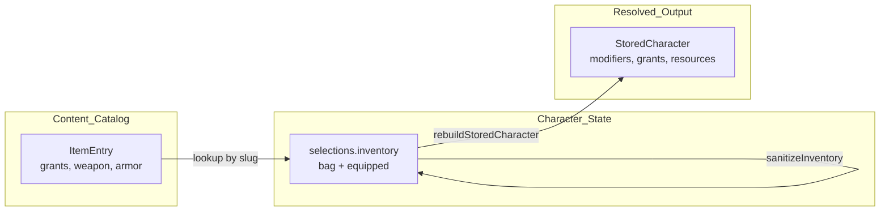

# API contract — inventory and characters (deferred)

This document describes the **future HTTP API** for character persistence and
inventory. It is aligned with the web app implementation today. **No routes exist
in this repository yet** — this is contract notes only.

P1 (playable table, bundled catalog, `localStorage` disk) **does not change this
HTTP contract**. Remote character persistence remains deferred (conversation P3).

Reference implementation (web):

- Types: [`packages/domain/src/inventory/inventory.types.ts`](../packages/domain/src/inventory/inventory.types.ts)
- Inventory ops + sanitize: [`apps/web/lib/character/inventory.ts`](../apps/web/lib/character/inventory.ts)
- Rebuild: [`apps/web/lib/character/buildCharacter.ts`](../apps/web/lib/character/buildCharacter.ts) (`rebuildCharacterWithInventory`)
- Persisted shape: [`apps/web/lib/character/storedCharacter.ts`](../apps/web/lib/character/storedCharacter.ts)
- Item definitions: Open5e catalog + [`packages/content/src/curation/itemOverlays.dnd.ts`](../packages/content/src/curation/itemOverlays.dnd.ts); types in [`packages/content/src/item/item.types.ts`](../packages/content/src/item/item.types.ts)

---

## Principles

1. **Do not reimplement rules on the server.** Run the same pipeline as the web:
   `sanitizeInventory` → merge into `selections.inventory` → `rebuildStoredCharacter`.
2. **Separate three layers:**
   - **Definition** (`ItemEntry`) — global catalog per `system`
   - **State** (`CharacterInventory`) — per-character `selections.inventory`
   - **Derived** (`modifiers`, `grants`, resource **maxima**) — rebuilt on every change; never trusted from the client
   - **Session currents** (`resources` remaining uses, plus `session` concentration / active conditions / temp HP / death saves) — preserved on rebuild. Resources are clamped to the new maxima; hit-dice remaining is preserved and credits new dice on level-up. `session` is sanitized but not derived. HP is synced to resolved max. Short rest does **not** clear `session`. Long rest clears `tempHp` and `deathSaves`.
3. **`schemaVersion`** lives on the `StoredCharacter` root (currently `1`). Inventory has no separate version in v1.
4. **Only equipped slugs** feed `collectGrantSources`. Bag-only items do not alter stats or grants.
5. **Starting loot** is materialized at **build/PUT** time from `inventory_item` grants (background v1), not via inventory PATCH alone. Granted stacks carry optional `provenance`; manual stacks omit it. Rebuild re-materializes provenance stacks and preserves manual ones.


```mermaid
flowchart LR
  subgraph contentLayer [Content_Catalog]
    ItemEntry["ItemEntry\ngrants, weapon, armor"]
  end
  subgraph stateLayer [Character_State]
    Inventory["selections.inventory\nbag + equipped"]
  end
  subgraph resolvedLayer [Resolved_Output]
    Stored["StoredCharacter\nmodifiers, grants, resources"]
  end
  ItemEntry -->|"lookup by slug"| Inventory
  Inventory -->|"sanitizeInventory"| Inventory
  Inventory -->|"rebuildStoredCharacter"| Stored
```

---

## StoredCharacter — full payload

`GET /characters/:id` and `PUT /characters/:id` use the full `StoredCharacter`
shape. After `normalizeStoredCharacter`, `selections.inventory` is always present.

| Field | Type | Notes |
|-------|------|-------|
| `id` | `string` | Stable character id |
| `schemaVersion` | `number` | Currently `1`; enables future migrations |
| `type` | `"player" \| "npc"` | Character type |
| `system` | `string` | e.g. `"dnd"` |
| `language` | `string` | Locale for user-authored free text |
| `name` | `string` | Display name |
| `baseStats` | `BaseStats` | Ability scores and preset stats |
| `modifiers` | `Modifier[]` | **Derived** — includes item modifiers when equipped |
| `grants` | `CharacterGrant[]` | **Derived** — spells, proficiencies, etc. |
| `selections` | `CharacterSelections` | Authoritative slugs + inventory state |
| `selections.inventory` | `CharacterInventory` | **Required** after normalize |
| `selections.choices` | `{ grantPicks?: Record<string, string> }` | Grant pick answers |
| `selections.currency` | `Record<string, number>` | Playable pouch (`platinum`/`gold`/`electrum`/`silver`/`copper` for D&D). Seeded once from grants + form extras; sheet edits persist here. Rebuild preserves it. |
| `selections.grantedCurrency` | `Record<string, number>` | Currency from class/background grants (rebuilt each save; wizard preview only) |
| `resources` | `Record<string, number>` | **Current** remaining for HP, spell slots, rage, ki, hit dice, etc. Rebuild preserves current (except HP, which is synced to resolved max). Hit-dice max comes from `vitality`, not grants. |
| `session` | `{ concentratingOn?, activeConditions?, tempHp?, deathSaves? }` | Optional table-session currents. Rebuild preserves like `resources`. Omitted when empty. `schemaVersion` stays **1**. |
| `systemData` | `Record<string, unknown>` | Level, AC, free text. Do **not** store the pouch here. |

### Forbidden in `systemData`

Do **not** persist inventory in `systemData`. These legacy keys are stripped on
`normalizeStoredCharacter`:

- `startingItem`
- `items` (array)
- `equippedItems`
- `inventory` (numeric)
- `gold`, `silver`, `bronze`, `copper`, `electrum`, `platinum` (legacy pouch fields; migrated into `selections.currency`)

Use `selections.inventory` only.

### Example (truncated)

Fighter L1, CON 14, empty inventory:

```json
{
  "id": "char-fighter-1",
  "schemaVersion": 1,
  "type": "player",
  "system": "dnd",
  "language": "en",
  "name": "Test Hero",
  "baseStats": { "attributes": { "constitution": 14 } },
  "modifiers": [],
  "grants": [],
  "selections": {
    "characterClass": "fighter",
    "inventory": { "bag": [], "equipped": {} },
    "choices": {}
  },
  "resources": { "hp": 12 },
  "systemData": { "level": 1, "ac": 12 }
}
```

On load, `normalizeStoredCharacter` → `sanitizeInventory` inside
`normalizeCharacterSelections`.

---

## CharacterInventory — state shape

```json
{
  "bag": [{ "slug": "rpv_amulet-of-vitality", "quantity": 1 }],
  "equipped": { "neck": "rpv_amulet-of-vitality" }
}
```

| Field | Type | Description |
|-------|------|-------------|
| `bag` | `ItemStack[]` | Owned items: `{ slug, quantity, provenance? }` |
| `equipped` | `Record<string, string>` | `slotId → item slug` (single occupancy; feeds grants/AC) |
| `equippedMulti` | `Record<string, string[]>` | Multi slots (e.g. `cosmetic`); roleplay only |

Pilot D&D slot IDs (from
[`equipmentSlots.dnd.ts`](../packages/content/src/curation/equipmentSlots.dnd.ts)):
Wearable: `helmet`, `cloak`, `breast`, `gloves`, `boots`, `amulet`, `ring`, `ring-2`.
Usable: `melee-main`, `melee-off`, `ranged-main`, `ranged-off`; multi `usable`.
Cosmetic multi: `cosmetic`.
Legacy ids (`armor`, `neck`, `main-hand`, `off-hand`) are migrated on sanitize.
Legacy single `equipped.usable` is migrated into `equippedMulti.usable`.

### Sanitization invariants

The server **always** runs `sanitizeInventory(inventory, character.system)`
before persisting. Behavior matches
[`apps/web/lib/character/inventory.ts`](../apps/web/lib/character/inventory.ts):

| Rule | Server behavior |
|------|-----------------|
| Unknown slug for `system` | Removed from bag and equipped slots (includes legacy short IDs like `longsword` that are not Open5e/`rpv_*` keys) |
| `quantity < 0` | Stack removed |
| `quantity === 0` | Kept in bag until explicitly deleted |
| Invalid slot ID for `system` | Equipped entry discarded |
| Item↔slot type mismatch | Not checked — any known item may occupy any valid slot |
| Same slug in two slots | Only the first iterated slot kept |
| Non-stackable item with `quantity > 1` in bag | Clamped to 1 |
| Duplicate bag stacks (same slug + same provenance) | Merged |
| Duplicate bag stacks (same slug, different provenance) | Kept separate (manual vs granted) |
| Bag ↔ equipped reconciliation | Each equipped slug consumes 1 unit from bag (`reconcileEquippedWithBag`) |

**PATCH clients:** the response may differ from the request after sanitize. The
API always returns the **canonical** post-sanitize inventory inside the rebuilt
`StoredCharacter`.

---

## PATCH /characters/:id/inventory

v1 uses **full replacement** of `selections.inventory` (not incremental ops).

### Request

```http
PATCH /characters/:id/inventory
Content-Type: application/json

{
  "bag": [
    { "slug": "rpv_amulet-of-vitality", "quantity": 1 }
  ],
  "equipped": {}
}
```

- Replaces the entire `selections.inventory` object (no partial merge).
- Do **not** accept other `selections` fields on this endpoint (race, class, etc.).
- Client must **not** send `modifiers`, `grants`, or derived `resources` as source of truth.

### Response `200 OK`

Full `StoredCharacter` after rebuild (not inventory-only), so the client can
replace its local cache — same pattern as `useCharacterStore` +
`rebuildCharacterWithInventory`.

### Errors

| Status | When |
|--------|--------|
| `400` | Body is not an object; `bag` is not an array; stack missing `slug` or `quantity`; `equipped` is not an object |
| `404` | Character not found |

**Sanitize failures:** prefer **`200` + sanitized state** (parity with web —
sanitize never throws; invalid data is corrected or dropped). Do not use `422`
for “all slugs invalid”; return empty/canonical inventory instead.

`If-Match` / ETag for optimistic concurrency is a **future extension**, not v1.

### Server pipeline

```
character = load(id)
nextInventory = sanitizeInventory(body, character.system)
formData = flattenStoredToForm(character)
rebuilt = rebuildStoredCharacter(
  character,
  { ...formData, inventory: nextInventory },
  character.language
)
save(rebuilt)
return rebuilt
```

Equivalent to web: `rebuildCharacterWithInventory(existing, nextInventory, locale)`.

### Side effects on rebuild

- `modifiers` and `grants` recalculated from equipped slugs + race/class/etc.
- `resources` **current** values (spell slots, rage, ki, …) are preserved and
  clamped to the new maxima via `mergeSessionResources`. Do not restore currents
  from `deriveResourceTotals`.
- `session` (concentration, active conditions, temp HP, death saves) is preserved via
  `sanitizeCharacterSession`. Do not drop it on rebuild. Long rest clears `tempHp`
  and `deathSaves`; short rest does not.
- `resources.hp` adjusted via `syncResourceHpToResolvedMax` (clamped down if max HP decreases, e.g. after unequip)

---

## Other character endpoints (context)

| Method | Purpose |
|--------|---------|
| `GET /characters/:id` | Returns full `StoredCharacter` |
| `PUT /characters/:id` | Replaces character (create/edit flow); `normalizeStoredCharacter` + build |
| `PATCH /characters/:id/inventory` | **Only v1 endpoint** for mutating bag / equipped |

Clients never POST derived `modifiers`/`grants` as authoritative data.

---

## Item catalog — read-only

Global per `system`, not per character.

### GET /systems/:system/items

Returns:

```json
{
  "items": [
    {
      "slug": "rpv_amulet-of-vitality",
      "system": "dnd",
      "name": "Amulet of Vitality",
      "description": "...",
      "category": { "name": "Wondrous Item", "key": "wondrous-item" },
      "weapon": null,
      "armor": null,
      "stackable": false,
      "grants": [
        {
          "grantType": "stat_modifier",
          "choose": 0,
          "targetStat": "hitPoints",
          "amount": 5
        }
      ]
    }
  ]
}
```

Optional query: `?locale=pt-BR` (parity with `getItem(slug, system, locale)`).

### GET /systems/:system/items/:slug

Returns a single `ItemEntry` or `404`.

`ItemEntry` shape — see
[`packages/content/AGENTS.md`](../packages/content/AGENTS.md) (Item authoring).

Community item publish (`POST /items`) is **out of v1 scope**.

---

## Equipment slots — read-only

### GET /systems/:system/equipment-slots

```json
{
  "slots": [
    { "id": "helmet", "labelKey": "equipmentSlots.helmet", "group": "wearable" },
    { "id": "cloak", "labelKey": "equipmentSlots.cloak", "group": "wearable" },
    { "id": "breast", "labelKey": "equipmentSlots.breast", "group": "wearable" },
    { "id": "gloves", "labelKey": "equipmentSlots.gloves", "group": "wearable" },
    { "id": "boots", "labelKey": "equipmentSlots.boots", "group": "wearable" },
    { "id": "amulet", "labelKey": "equipmentSlots.amulet", "group": "wearable" },
    { "id": "ring", "labelKey": "equipmentSlots.ring", "group": "wearable" },
    { "id": "ring-2", "labelKey": "equipmentSlots.ring2", "group": "wearable" },
    { "id": "melee-main", "labelKey": "equipmentSlots.meleeMain", "group": "usable" },
    { "id": "melee-off", "labelKey": "equipmentSlots.meleeOff", "group": "usable" },
    { "id": "ranged-main", "labelKey": "equipmentSlots.rangedMain", "group": "usable" },
    { "id": "ranged-off", "labelKey": "equipmentSlots.rangedOff", "group": "usable" },
    { "id": "usable", "labelKey": "equipmentSlots.usable", "group": "usable", "multi": true },
    { "id": "cosmetic", "labelKey": "equipmentSlots.cosmetic", "group": "cosmetic", "multi": true }
  ]
}
```

Clients use `id` in `equipped`; `labelKey` for i18n overlays.

---

## Walkthrough — equip amulet (+5 max HP)

Fixture: fighter L1, CON 14 → base max HP **12**. Equipping
`amulet-of-vitality` in `amulet` → max HP **17**.

Aligned with
[`useCharacterStore.inventory.test.ts`](../apps/web/__tests__/useCharacterStore.inventory.test.ts)
and
[`characterCardInventory.test.tsx`](../apps/web/__tests__/characterCardInventory.test.tsx).

### Step 1 — GET character

```http
GET /characters/char-fighter-1
```

```json
{
  "id": "char-fighter-1",
  "schemaVersion": 1,
  "selections": {
    "characterClass": "fighter",
    "inventory": {
      "bag": [{ "slug": "rpv_amulet-of-vitality", "quantity": 1 }],
      "equipped": {}
    }
  },
  "modifiers": [],
  "resources": { "hp": 12 }
}
```

Resolved max HP: **12** (amulet in bag only — no item modifiers).

### Step 2 — PATCH inventory (equip neck)

```http
PATCH /characters/char-fighter-1/inventory
Content-Type: application/json

{
  "bag": [],
  "equipped": { "neck": "rpv_amulet-of-vitality" }
}
```

### Step 3 — Response

```json
{
  "id": "char-fighter-1",
  "schemaVersion": 1,
  "selections": {
    "inventory": {
      "bag": [],
      "equipped": { "neck": "rpv_amulet-of-vitality" }
    }
  },
  "modifiers": [
    {
      "stat": "hitPoints",
      "operation": "add",
      "value": 5,
      "source": { "type": "item", "id": "rpv_amulet-of-vitality" }
    }
  ],
  "resources": { "hp": 12 }
}
```

Resolved max HP: **17**. If the character had `hp: 17` at max and unequips,
`resources.hp` clamps to **12**.

### Step 4 — PATCH unequip (optional)

```http
PATCH /characters/char-fighter-1/inventory

{
  "bag": [{ "slug": "rpv_amulet-of-vitality", "quantity": 1 }],
  "equipped": {}
}
```

Response: item modifiers removed; max HP back to **12**; `hp` clamped if needed.

---

## Future extensions (not v1)

- PATCH with incremental **ops** (`addToBag`, `removeFromBag`, `equip`, `unequip`)
- Weight, attunement, unique instances
- `POST /systems/:system/items` (community publish + moderation)
- `If-Match` / ETag on character or inventory
- Shared build package for server (`@rpv/build` or extract `inventory.ts` + `buildCharacter` from web)

**Already implemented in web (pilot):** class/background `inventory_item` (fixed
and `choose > 0`), `currency` grants, `grantedCurrency` (wizard preview),
playable `selections.currency` pouch on the sheet, and create/edit UI via
`StartingEquipmentField`.
