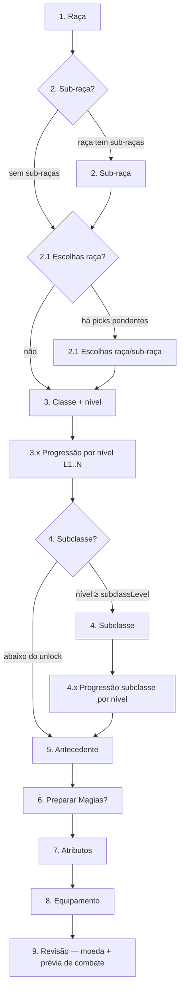

# Criação de Personagem — Especificação e Roadmap

Este documento é a fonte de verdade para o fluxo de criação/edição de personagens
jogadores. As **fases A–H** estão implementadas no código; o residual está em §11.

Referências no código:

- Formulário: [`apps/web/components/characters/PlayerCharacterForm.tsx`](../apps/web/components/characters/PlayerCharacterForm.tsx)
- Resolução de etapas: [`apps/web/lib/character/creationSteps/`](../apps/web/lib/character/creationSteps/)
- Escolhas de grants: [`apps/web/lib/character/grantChoices.ts`](../apps/web/lib/character/grantChoices.ts)
- Magias: [`SpellChoiceGrid`](../apps/web/components/characters/creation/spells/SpellChoiceGrid.tsx)
- Itens / exclusive: [`ItemChoiceGrid`](../apps/web/components/characters/creation/items/ItemChoiceGrid.tsx), [`ExclusiveBranchChoice`](../apps/web/components/characters/creation/items/ExclusiveBranchChoice.tsx)
- Pipeline de build: [`PROJECT_CONTEXT.md`](../PROJECT_CONTEXT.md)
- Princípios de engine: [`AGENTS.md`](../AGENTS.md)

---

## 1. Objetivos

| Objetivo | Descrição |
|----------|-----------|
| Seleção rica | Raças, sub-raças, classes e subclasses exibem descrição e recursos concedidos antes/durante a escolha |
| Magias e itens clicáveis | Truques, magias e itens de escolha usam UI rica (cards + modal de detalhe), não apenas `<select>` |
| Etapas dedicadas | Cada tipo de escolha relevante tem sua própria página no wizard quando aplicável |
| Progressão por nível | Personagens acima do nível 1 percorrem ganhos e escolhas **nível a nível**, sem agrupar tudo |
| Navegação livre | Manter o comportamento atual: qualquer etapa acessível, save permitido com pendências (exceto picks inválidos) |
| Sistema-agnóstico | Nenhum hardcode de D&D na web ou no domain; tudo derivado de `Grant`, catálogo e curation por sistema |

---

## 2. Princípios não negociáveis

1. **O motor não muda de forma.** `Grant` → `grantPicks` → `deriveCharacterGrants` → `StoredCharacter` permanece o contrato. A reformulação é **orquestração de wizard + apresentação**.
2. **Conteúdo é dado.** Textos, pools de magia, bônus de atributo distribuíveis (+2/+1), proficiências e itens vêm de curation (`*.dnd.ts` hoje; `*.pf2e.ts` amanhã) e catálogo — nunca de `if (race === 'half-elf')` na UI.
3. **UI rica por tipo de grant, não por sistema.** Componentes genéricos (`SpellChoiceGrid`, `ItemChoiceGrid`) consomem `ContentRepository`; o sistema ativo vem do preset/form.
4. **Escopo incremental de UI rica (v1).** Apenas **magias** e **itens** ganham cards + modal na primeira entrega. Perícias, idiomas, ASI e demais grants continuam com pickers simples até uma fase posterior — exceto na etapa de Atributos (ver §6).
5. **Detalhe em modal.** Magias e itens abrem modal com dados do catálogo (`SpellCatalogEntry`, `ItemEntry`).

---

## 3. Fluxo de etapas (alvo)

O wizard deixa de ser um array fixo de 5 passos e passa a ser um **grafo dinâmico** computado a partir do estado do formulário (`resolveCreationSteps(formValues)`).

### 3.1 Ordem macro



### 3.2 Etapas fixas (sempre presentes)

| # | ID sugerido | Conteúdo |
|---|-------------|----------|
| 1 | `race` | Seleção de raça (cards com descrição + preview de traits fixos) |
| 3 | `class` | Seleção de classe + **seletor de nível** (`CharacterLevelSelector`) |
| 5 | `background` | Antecedente + campos de identidade (nome, idade, objetivos) |
| 7 | `abilities` | Atributos, bônus distribuíveis, revisão de proficiências em perícias (macro **Finalizar**) |
| 8 | `equipment` | Equipamento inicial (`StartingEquipmentField`) |
| 9 | `review` | Moeda manual + prévia de combate (HP / CA / recursos) |

### 3.3 Etapas condicionais

| Etapa | Condição de exibição |
|-------|----------------------|
| `subrace` | `getRace(slug).subraces.length > 0` |
| `race-choices` | `collectPendingChoiceGrants` com `sourceTypes` race/subrace e picks ainda não preenchidos |
| `class-level-{n}` | Para cada nível `n` de 1 até `level` selecionado — ver §4 |
| `subclass` | Classe selecionada e `level >= subclassLevel` |
| `subclass-level-{n}` | Para cada nível em que a subclasse concede features com escolhas |
| `*-cantrips` / `*-spells` | Sub-etapas dentro de raça, classe ou subclasse quando há `grantType: "spell"` com pools distintos (truque vs magia de nível > 0) |

**Raças sem sub-raça** (ex.: Humano): a etapa `subrace` **não aparece** no stepper nem na navegação.

### 3.4 Layout de seleção (raça, sub-raça, classe, subclasse)

- Opções dispostas **lado a lado** ou no melhor layout responsivo que caiba na página (grid de cards).
- Cada card mostra: nome, descrição resumida, lista de recursos fixos (`GrantPreviewList`).
- Grants que são escolhas (`choose > 0`) aparecem como indicador (“você escolherá truques na próxima etapa”) — a escolha em si ocorre na sub-etapa dedicada.
- Magias/itens fixos ou em pool são **clicáveis** → modal de detalhe (somente leitura na etapa de seleção de raça/classe; selecionáveis nas etapas de pick).

### 3.5 Ordem: subclasse após truques/magias de classe

A subclasse vem **depois** das etapas de truques e magias da **classe** porque a subclasse pode adicionar seus próprios truques e magias. Fluxo:

1. Classe + nível
2. Para cada nível L1..N: ganhos da classe (HP, recursos, escolhas) — incluindo sub-etapas de truques/magias da classe naquele nível
3. Subclasse (quando desbloqueada)
4. Para cada nível aplicável: ganhos da subclasse — incluindo sub-etapas de truques/magias da subclasse
5. Antecedente → [Preparar Magias?] → Atributos → Equipamento → Revisão

---

## 4. Progressão por nível (nível > 1)

O nível continua definido na etapa **Classe** (`systemData.level` via `readLevelFromForm`). Após a seleção de classe e nível, o wizard **não agrupa** todas as escolhas de L1–N em uma única tela.

### 4.1 Uma sub-etapa por nível

Para cada `n` em `1..level`, exibir uma página `class-level-{n}` que mostra **apenas** o que é ganho naquele nível:

| Tipo de ganho | Fonte de dados | UI |
|---------------|----------------|-----|
| Aumento de vida | preset / `HitPointsField` hints | Informativo + campo se aplicável |
| Recursos de classe | `resource` grants em `featuresByLevel` | Chips / `ClassResourcesField` parcial |
| Proficiências fixas | grants `choose: 0` | `GrantPreviewList` |
| Escolhas (perícia, idioma, etc.) | `choose > 0` | Picker simples (v1) ou sub-etapa |
| Truques / magias | `grantType: "spell"` | Sub-etapa dedicada com UI rica |
| Features de subclasse | `subclass` + `featuresByLevel` | Mesmo padrão na seção `subclass-level-{n}` |

A agregação de grants por nível já existe em [`resolveLevelFeatures`](../packages/content/src/grant/levelFeatures.ts) e [`getClassGrantSourcesForLevel`](../packages/content/src/curation/classGrants.dnd.ts); a UI deve **filtrar por `feature.level === n`**, não reimplementar regras.

### 4.2 Exemplo (Wizard nível 3)

Ordem ilustrativa (sub-etapas omitidas se vazias):

1. `class` — escolhe Wizard, nível 3
2. `class-level-1` — proficiências fixas, 3 truques → `class-level-1-cantrips`
3. `class-level-1` (continuação) — 2 magias L1 → `class-level-1-spells`
4. `class-level-2` — spell slots +2 (informativo)
5. `class-level-3` — spell slots +2, 1 magia L2 → `class-level-3-spells`
6. `subclass` — escolhe Evocation
7. `subclass-level-2` — feature da subclasse (se houver picks)
8. … antecedente, atributos, final

---

## 5. Escolhas de magias e itens (UI rica)

### 5.1 Truques vs magias

Ambos usam `grantType: "spell"`. A distinção é pelo **pool** resolvido (`resolveGrantPool` + `levelInt` do catálogo):

- **Truques:** `levelInt === 0` (ou equivalente definido na curation do sistema)
- **Magias:** `levelInt > 0`, possivelmente filtradas por nível máximo do personagem

Sub-etapas separadas (`*-cantrips`, `*-spells`) agrupam picks do mesmo tipo para uma mesma fonte (raça, classe, subclasse) e nível.

### 5.2 Componentes previstos

| Componente | Responsabilidade |
|------------|------------------|
| `SpellChoiceGrid` | Grid de cards: nome, nível, escola, casting time; seleção única ou N slots |
| `SpellDetailModal` | Descrição completa de `SpellCatalogEntry` |
| `ItemChoiceGrid` | Cards com categoria, stats de arma/armadura quando `weapon` / `armor` existir |
| `ItemDetailModal` | Descrição de `ItemEntry` + grants concedidos |
| `GrantChoicePage` | Container: título da escolha, slot N/M, delega ao picker por `grantType` |

### 5.3 Persistência

Continua em `selections.choices.grantPicks` com as mesmas chaves:

```
{sourceType}:{sourceId}:{levelSegment}:{grantType}:{grantIndex}:{slot}
```

A UI rica **não introduz** novo formato de persistência.

### 5.4 Validação e sanitização

Reutilizar:

- [`choiceValidation.ts`](../apps/web/lib/character/choiceValidation.ts) — duplicatas, picks inválidos bloqueiam save
- [`grantPickSanitize.ts`](../apps/web/lib/character/grantPickSanitize.ts) — conflitos entre fontes
- [`pendingDecisions.ts`](../apps/web/lib/character/pendingDecisions.ts) — pendências e deep links na edição

Cada pendência deve apontar para a **sub-etapa exata** (ex.: `class-level-1-cantrips`, slot 2/3).

---

## 6. Etapa de Atributos (macro Finalizar)

Posição: no grupo **Finalizar**, imediatamente antes de Equipamento / Revisão (e depois de Preparar Magias, quando existir).

### 6.1 Geração de scores

Manter métodos existentes do preset (`standard-array`, `point-buy`, `roll`, `manual`) via [`AbilityScoresField`](../apps/web/components/characters/AbilityScoresField.tsx) e `PresetStatConfig.abilityGeneration`.

### 6.2 Bônus distribuíveis (+2 / +1)

Raças como Half-Elf declaram grants `ability_score` com `choose > 0` e `amount` nos dados de curation — **não** na UI.

Requisitos da etapa:

- Detectar grants `ability_score` distribuíveis ainda não resolvidos (via `collectPendingChoiceGrants` ou equivalente filtrado por `grantType === "ability_score"`).
- Permitir atribuir **+2 a uma habilidade** e **+1 a outra** quando o conteúdo declarar esse padrão (dois slots com `amount` 2 e 1, ou como modelado nos traits da raça).
- Persistir em `grantPicks` com as chaves existentes (ex.: `race:half-elf:base:ability_score:1:0`).
- Exibir preview racial + distribuível no total de cada atributo.

Se um sistema futuro usar outro padrão (ex.: +1 em três stats), a UI lê `choose` e `amount` dos grants — sem branch por raça.

### 6.3 Proficiências em perícias

A etapa deve **listar todas as proficiências em perícias** já concedidas (fixas + escolhidas em etapas anteriores) e permitir **alterá-las** dentro das opções ainda válidas:

- Fonte: grants resolvidos + picks de `skill_proficiency` pendentes ou preenchidos
- O usuário pode trocar uma perícia escolhida se outra opção do mesmo pool ainda estiver disponível
- Conflitos (ex.: mesma perícia em classe e antecedente) continuam sendo tratados por `pruneConflictingGrantPicks` ao mudar antecedente/classe — a etapa de atributos é o lugar de **revisão final** antes do save

Perícias **não** usam UI rica de cards na v1; podem permanecer como lista editável / select até fase posterior.

---

## 7. Equipamento e Revisão

### 7.1 Equipamento (`equipment`)

- `StartingEquipmentField` — escolhas de equipamento inicial; itens com UI rica quando forem opções de `inventory_item` / bundles
- Pendências de inventário / exclusive / currency picks apontam para esta etapa

### 7.2 Revisão (`review`) — última etapa de create/edit

- Moeda manual (`gold`, `silver`, `bronze`) se o preset expuser
- Prévia de combate (HP / CA / recursos de classe)
- Save com nome padrão se nome vazio (comportamento atual)

Pendências incompletas continuam listadas na sidebar com deep links (`?step=` na edição). Level-up usa `level-up-confirm` (“Confirmar”), não `review`.

---

## 8. Arquitetura técnica (web)

### 8.1 Novo módulo: resolução de etapas

```
apps/web/lib/character/creationSteps/
  resolveCreationSteps.ts   # grafo dinâmico a partir do form
  creationStep.types.ts     # CreationStepId, CreationStep, StepKind
  mapGrantPickToStep.ts     # substitui/estende getStepIndexForGrantPickKey
```

Cada `CreationStep`:

```ts
type CreationStep = {
  id: string;                    // ex. "class-level-3-spells"
  kind: "selection" | "grant_picks" | "level_summary" | "abilities" | "equipment" | "review" | "finalize";
  labelKey: string;              // i18n
  parentId?: string;
  sourceFilter?: { sourceTypes, level?, grantTypes?, spellTier? };
  fieldNames?: string[];         // campos do form nesta etapa
};
```

### 8.2 Stepper

[`CharacterCreationSidebar`](../apps/web/components/characters/creation/CharacterCreationSidebar.tsx) consome o grafo de `resolveCreationSteps()`:

- Stepper **macro** (Raça, Classe, Antecedente, Magias, Finalizar) com indicador de sub-etapas pendentes
- Finalizar agrupa: Atributos, Equipamento, Revisão
- Ou lista achatada com indentação visual para sub-etapas — decisão de implementação; o grafo suporta ambos

### 8.3 Roteamento de conteúdo por etapa

[`PlayerCharacterForm`](../apps/web/components/characters/PlayerCharacterForm.tsx) renderiza um componente por `step.kind`:

| kind | Componente |
|------|------------|
| `selection` | `RaceSelectionPage`, `SubraceSelectionPage`, `ClassSelectionPage`, `SubclassSelectionPage` |
| `level_summary` | `LevelProgressionPage` — structured gain preview (average HP before→after, class/subclass resources, spell/cantrip pick counts, subclass unlock) plus remaining fixed grants |
| `grant_picks` | `GrantChoicePage` → `SpellChoiceGrid` / `ItemChoiceGrid` / pickers legados |
| `abilities` | `AbilitiesStepPage` (scores + ASI picks + skill review) |
| `equipment` | `StartingEquipmentField` |
| `review` | `CharacterReviewPage` (moeda manual + prévia de combate) |
| `finalize` | level-up confirm (HP + recursos) |

### 8.4 Preview de grants

```
apps/web/components/characters/creation/
  GrantPreviewList.tsx      # traduz Grant[] em chips/links
  CatalogSelectionCard.tsx # card genérico para raça/classe/subclasse/background
  spells/SpellChoiceGrid.tsx
  spells/SpellDetailModal.tsx
  items/ItemChoiceGrid.tsx
  items/ItemDetailModal.tsx
```

`GrantPreviewList` reutiliza padrões de [`classStepDisplay.ts`](../apps/web/lib/character/classStepDisplay.ts) e [`raceDisplay.ts`](../apps/web/lib/character/raceDisplay.ts).

### 8.5 O que **não** muda

| Camada | Motivo |
|--------|--------|
| `@rpv/domain` | Resolução de modifiers/stats permanece genérica |
| Formato `StoredCharacter` | Sem migration de schema para esta reformulação |
| `grantPicks` keys | Compatibilidade com personagens existentes |
| `@rpv/content` grant helpers | Pools e `resolveGrantPool` já são data-driven |

Extensões em `@rpv/content` só se um primitive genuinamente novo for necessário (ex.: novo `grantType`); preferir modelar +2/+1 como `ability_score` distribuível existente.

---

## 9. Navegação e edição

- **Navegação livre** entre etapas (comportamento atual).
- **Deep links:** `?step={creationStepId}` e opcional `?focus={grantPickKey}` na criação e edição.
- **`PendingDecisionsPanel`:** cada item linka para `step` + `focus` quando aplicável.
- **Modo edição** usa o **mesmo wizard** que criação.

---

## 10. i18n e locale

- Rótulos de etapas: `messages/*.json` → `characterCreation.steps.*`
- Textos de conteúdo: `contentLocale` + overlays do catálogo (`SpellCatalogEntry`, `RaceCatalogEntry`, etc.)
- Nunca assumir que descrição está traduzida; fallback para locale padrão do catálogo.

---

## 11. Fases de implementação

| Fase | Entrega | Estado |
|------|---------|--------|
| **A** | `resolveCreationSteps` + stepper dinâmico + `?step=` | Feito |
| **B** | Páginas de seleção: Raça, Sub-raça, Classe + nível | Feito |
| **C** | `SpellChoiceGrid` + modal + sub-etapas de truques/magias | Feito |
| **D** | Progressão `class-level-{n}` para L1–N | Feito |
| **E** | Subclasse + `subclass-level-{n}` + magias de subclasse | Feito |
| **F** | Antecedente (seleção rica, picks simples) | Feito |
| **G** | Etapa Atributos: +2/+1 distribuível + revisão de perícias | Feito |
| **H** | `ItemChoiceGrid` + exclusive cards + Final / equipamento | Feito |
| **I** | Testes de integração, polish mobile, docs | Feito (core) |

**Residual (pós-H):**

- UI rica para `currency` choices (hoje `<select>`)
- UI rica para perícias / idiomas / ferramentas
- Highlight polish adicional em mobile se necessário

---

## 12. Testes

- Unit: `resolveCreationSteps`, `mapGrantPickToStep`, `buildItemPickContentModel`
- Component: `SpellChoiceGrid`, `ItemChoiceGrid`, `StartingEquipmentField`
- Integração: High Elf → Wizard; Half-Elf ASI; Fighter L3 equipment; pending `?step=&focus=`
- Regressão: `choiceValidation`, `grantPickSanitize`, pipeline `buildStoredCharacter`

Comando: `npm test -w rpv-front`

---

## 13. Fora de escopo (esta reformulação)

- Multiclasse
- Feats / ASI de nível de classe como escolha separada (além do que já está em grants)
- UI rica para perícias, idiomas e ferramentas (fase posterior)
- Catálogo completo SRD — depende de expansão de conteúdo, não deste wizard
- Backend / API de persistência remota

---

## 14. Checklist para novos conteúdos (autores)

Ao adicionar raça, classe, subclasse ou antecedente em curation:

1. Declarar todos os grants como dados (`Grant`); escolhas com `choose > 0` e pool explícito.
2. Para magias escolhíveis, garantir que o pool referencia slugs do catálogo de magias do sistema.
3. Para itens de equipamento inicial, usar `inventory_item` / `inventory_bundle` com slugs de `ItemEntry`.
4. Para bônus distribuíveis, usar `ability_score` com `choose` e `amount` — a etapa de Atributos renderiza automaticamente.
5. Features por nível em `featuresByLevel` com `level` correto para a progressão nível a nível.
6. Subclasse: definir `subclassLevel` na classe; grants da subclasse em `subclassGrants.{system}.ts`.
7. Não adicionar lógica na web — se a UI não suporta um novo `grantType`, estender o roteador de `GrantChoicePage` genericamente.

Ver também [`packages/content/AGENTS.md`](../packages/content/AGENTS.md).
