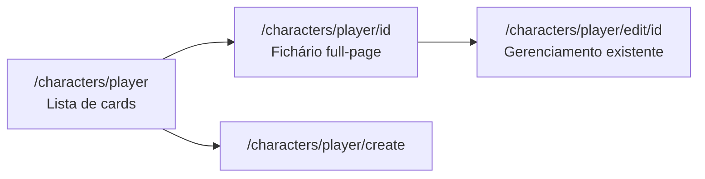
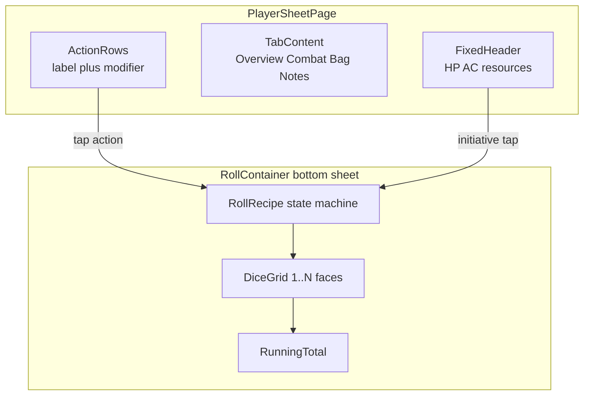
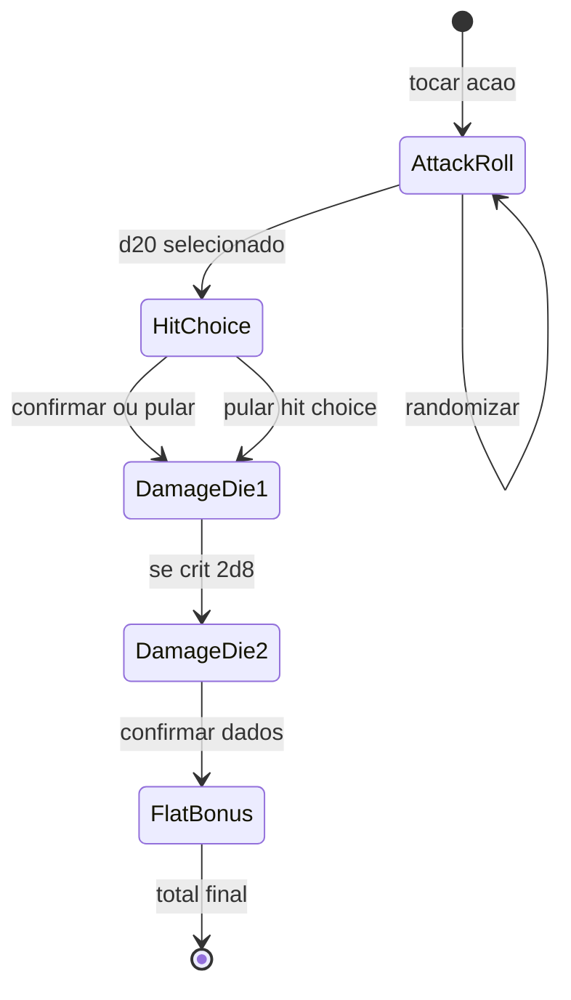

# Ficha de Jogador e Auxiliar de Rolagens

Este documento descreve a UI/UX da ficha full-page e o auxiliar de rolagens para mesa.
**Fases 1–3 estão implementadas** no código; a Fase 4 (polish) permanece residual.

Referências no código:

- Lista de jogadores: [`apps/web/app/characters/player/page.tsx`](../apps/web/app/characters/player/page.tsx)
- Ficha: [`apps/web/components/characters/PlayerSheet/`](../apps/web/components/characters/PlayerSheet/)
- Auxiliar de rolagens: [`apps/web/components/characters/PlayerSheet/roll/`](../apps/web/components/characters/PlayerSheet/roll/)
- Pipeline de personagem: [`PROJECT_CONTEXT.md`](../PROJECT_CONTEXT.md)

---

## 1. Contexto e objetivos

### Problema atual

Os personagens jogadores são exibidos como **cards compactos** agrupados em grid. Cada card possui um botão de maximizar que abre um **container flutuante** (`Dialog`) com informações organizadas em **carousel** de quatro páginas:

1. Character Info — classe, background, traits, objetivos
2. Skills — atributos, combate, saves, todas as 18 perícias
3. Actions & Abilities — recursos, features, magias, idiomas
4. Inventory — equipamento ativo, posses e cosmético (refactor em andamento)

Esse formato serve como preview rápido, mas **não é adequado para uso contínuo durante sessões**: área pequena, navegação por swipe, informações misturadas sem hierarquia clara para iniciantes.

### Objetivo

Substituir o dialog flutuante por uma **página dedicada estilo fichário físico** que o jogador mantém aberto na mesa. O sistema **não substitui** rolagens de dados físicos — auxilia **cálculos** e **organização** das capacidades do personagem.

### Princípios de design

| Princípio | Descrição |
|-----------|-----------|
| Ficha dispara, container calcula | A ficha mostra bônus pré-calculados (escaneável); o container inferior executa o passo a passo da rolagem. |
| Dados físicos primeiro | O jogador rola o dado na mesa e informa o resultado no app, ou usa randomização opcional. |
| Sem histórico | Rolagens não são persistidas; o auxiliar é efêmero por sessão de rolagem. |
| Sem alvos concretos | Não há AC de inimigo, saves de NPC ou comparação obrigatória — o MVP não modela alvos. |
| Liberdade de fluxo | O jogador pode **pular etapas**, **voltar**, **cancelar** ou **selecionar valores manualmente** a qualquer momento. |
| Crítico automático | Ao escolher **20** no grid de ataque, o crítico é aplicado automaticamente (dobra dados de dano, não flat). |

---

## 2. Navegação e rotas


```mermaid
flowchart LR
  list["/characters/player\nLista de cards"] --> sheet["/characters/player/id\nFichário full-page"]
  sheet --> edit["/characters/player/edit/id\nGerenciamento existente"]
  list --> create["/characters/player/create"]
```

| Rota | Papel |
|------|-------|
| `/characters/player` | Lista de cards compactos (launcher) |
| `/characters/player/[id]` | **Nova** — fichário full-page para sessão |
| `/characters/player/edit/[id]` | Gerenciamento/criação (já existe) |
| `/characters/player/create` | Criação de personagem (já existe) |

**Mudança no card compacto:** deixa de abrir `Dialog`; passa a ser preview (HP, AC, nome) + botão **Abrir fichário** que navega para `/characters/player/[id]`. O botão de editar (engrenagem) permanece apontando para a rota de gerenciamento.

---

## 3. Layout do fichário

O fichário é organizado em **três camadas**: header fixo, abas de conteúdo e container de rolagens (quando ativo).


```mermaid
flowchart TB
  subgraph sheetPage [PlayerSheetPage]
    header[FixedHeader\nHP AC resources]
    tabs[TabContent\nOverview Combat Bag Notes]
    actionRows[ActionRows\nlabel plus modifier]
  end
  subgraph rollContainer [RollContainer bottom sheet]
    recipe[RollRecipe state machine]
    grid[DiceGrid 1..N faces]
    total[RunningTotal]
  end
  actionRows -->|"tap action"| recipe
  recipe --> grid
  grid --> total
  header -->|"initiative tap"| recipe
```

### 3.1 Header fixo (todas as abas)

Sempre visível. Referência de interação de HP: [`IniciativeCard`](../apps/web/components/iniciative/IniciativeCard.tsx).

| Elemento | Comportamento |
|----------|---------------|
| Nome, nível, classe/subclasse | Leitura |
| Avatar | Opcional, compacto |
| HP | Editável (dano/cura com pipeline de vitalidade; slider só no HP atual). Temp HP (set) no mesmo bloco quando o sistema tem `vitality`. |
| Death saves | Visíveis com HP = 0; pips + rolagem opcional. Estável / morto são flags visuais. |
| Dados de vida | Pool restante (somente leitura) no painel Descanso da aba Ações. Gastar 1 só no modal do descanso curto. |
| AC | Leitura |
| Iniciativa | Leitura + atalho para abrir container de rolagem (Tipo A) |
| Recursos de classe | Editável (`+`/`-`) — spell slots, rage, ki, etc. |
| Toggle vantagem/desvantagem | Modo da sessão para rolagens d20 (Tipo D) |
| Navegação por abas | Estilo divisórias de fichário |
| Atalho Editar | Link para `/characters/player/edit/[id]` |

Recursos de classe reutilizam a lógica de [`DerivedResourcesDisplay`](../apps/web/components/characters/DerivedResourcesDisplay.tsx) e `stored.resources`.

### 3.2 Abas de conteúdo

| Aba | Foco | Conteúdo principal | Componentes existentes a reutilizar |
|-----|------|-------------------|-------------------------------------|
| **Visão geral** | Gameplay — o que o personagem sabe e pode (fora da economia de ataque) | Retrato, atributos + testes, passivas, perícias (proficientes por padrão), fatos mecânicos (antecedente, tamanho, sentidos, dado de vida), proficiências (armas, armaduras, ferramentas, idiomas), características | [`OverviewTab`](../apps/web/components/characters/PlayerSheet/tabs/OverviewTab.tsx), [`AbilitiesSection`](../apps/web/components/characters/PlayerSheet/overview/AbilitiesSection.tsx), [`SkillsCard`](../apps/web/components/characters/PlayerSheet/overview/SkillsCard.tsx) |
| **Combate** | Economia de ação | Ataques, ações/bônus/reações, magias, CD/ataque de magia, recursos de classe, defesa e resistências — agrupados por **tipo de ação**, não por origem (classe vs item) | [`CombatTab`](../apps/web/components/characters/PlayerSheet/tabs/CombatTab.tsx), [`CastingStatsPanel`](../apps/web/components/characters/PlayerSheet/combat/CastingStatsPanel.tsx), [`ClassResourcesPanel`](../apps/web/components/characters/PlayerSheet/combat/ClassResourcesPanel.tsx), [`DefenseSavesPanel`](../apps/web/components/characters/PlayerSheet/combat/DefenseSavesPanel.tsx) |
| **Mochila** | Posse e equipamento | Equipamento ativo + posses + cosmético + moeda; ver [`docs/INVENTORY.md`](INVENTORY.md) | [`InventoryTab`](../apps/web/components/characters/PlayerSheet/tabs/InventoryTab.tsx) (ficha); [`CharacterCardInventory`](../apps/web/components/characters/CharacterCard/CharacterCardInventory.tsx) (carousel legado) |
| **Anotações** | Persona (roleplay) + recados de sessão | Presença, disposição, personalidade D&D; notas do personagem (`StoredCharacter.notes`, mais recente primeiro). Card com expandir → modal para ler, editar (cor chart + compositor da action bar) e excluir | [`NotesTab`](../apps/web/components/characters/PlayerSheet/tabs/NotesTab.tsx), [`PersonaSection`](../apps/web/components/characters/PlayerSheet/notes/PersonaSection.tsx), [`CharacterNotesList`](../apps/web/components/characters/PlayerSheet/notes/CharacterNotesList.tsx), [`NoteDetailModal`](../apps/web/components/characters/PlayerSheet/notes/NoteDetailModal.tsx) |

#### Decisões de UX

- **Visão geral** não lista as 18 perícias por padrão — apenas as **proficientes**. Toggle "todas" já está na ficha. Saves completos ficam na aba Ações. Personalidade, idade aparente e prosa de antecedente saíram da Overview (Persona na aba Anotações).
- **Combate** é adaptativo: seção Magia oculta se o personagem não tiver spell grants. Descanso curto abre modal (recupera `recoverOn: short_rest`, gasta dados de vida aí); descanso longo continua um clique. Sem teto de shorts por longo.
- **Anotações:** Persona no topo (presença, disposição, campos D&D). Personalidade, idade, porte, voz, marcas e vestimenta vêm de `systemData`; eixos de disposição gravados (1–20) mostram slider somente leitura, omitidos mostram `—`. Rótulos vazios mostram `—`. Notas de sessão: criar pela action bar (`Quick note`); a aba lista os recados. Card mostra preview (primeira linha + até 3 linhas de corpo) e timestamp no topo, ao lado do expandir; cards da grade ocupam a altura da célula. Expandir abre modal (timestamp no topo na leitura). Editar reusa o compositor (primeira linha estilo iPhone) e mostra uma linha de cores (`bg-card` + `chart-1`…`chart-5`) acima de Excluir/Salvar; clicar na cor é preview no modal; Salvar nota grava (`color` no recorde) e fecha o modal. Save vazio na edição descarta o rascunho (texto e cor) e fecha sem gravar. Excluir apaga na hora. `visibility: "private"` no recorde, sem UI de share.

### 3.3 Responsividade

Sem priorizar um dispositivo — documentar comportamento por breakpoint:

| Breakpoint | Comportamento |
|------------|---------------|
| **Mobile (retrato)** | Abas full-width; container de dados ocupa ~40–50% da altura quando aberto |
| **Tablet (paisagem)** | Conteúdo em 2 colunas onde couber (Visão geral: identidade \| proficiências); container ~30% altura |
| **Desktop** | Layout denso, múltiplas colunas na Visão geral; container compacto na base |

Header fixo colapsável em mobile é opcional (Fase 4 — polish).

---

## 4. Linhas de ação na ficha

### Princípio

Cada ação tocável na ficha exibe: **rótulo + bônus principal + 1–2 pistas de contexto**. Nunca exibir grid de dados ou totais hipotéticos — isso fica no container.

### Matriz por tipo de ação

| Tipo de ação | Exibir na ficha | Ao tocar |
|--------------|-----------------|----------|
| Perícia | Nome, **+mod**, indicador de proficiência (●), atributo governante (ex. CHA) | Container Tipo A |
| Saving throw | Nome, **+mod**, proficiência se houver | Container Tipo A |
| Teste de atributo | "STR check **+3**" | Container Tipo A |
| Ataque (arma) | Nome, **+to-hit**, preview `1d8+3 slashing` | Container Tipo B |
| Magia (ataque) | Nome, **+spell attack**, fórmula de dano | Container Tipo B |
| Magia (save) | Nome, **DC X**, fórmula de dano | Container Tipo C |
| Cura | Nome, fórmula `1d8+4` | Container Tipo C |
| Feature sem rolagem | Nome, badge Action/Bonus/Reaction, usos `2/3` | Modal de confirmação de uso |
| Iniciativa | **+mod** no header fixo | Container Tipo A |

### Dependências de dados (gaps atuais)

| Capacidade | Estado hoje | Necessário para Fase 3 |
|------------|-------------|------------------------|
| Perícias, saves, atributos | `computeSkillModifiers`, `computeSavingThrowModifiers` | — |
| Ataque/dano de armas | [`ItemEntry.weapon`](../packages/content/src/item/item.types.ts) + combate na web | Metadados de ataque derivados (`toHit`, `damageDice`, tipo de dano) |
| Spell attack / DC | Spells como grants sem metadados estruturados | Metadados em spell catalog ou curation |
| Features por tipo de ação | `Grant.activation` / `CharacterGrant.activation` (`cost` slug + optional `resourceRef`) | Sem `activation` a ability não entra na aba de ações |

---

## 5. Container auxiliar de rolagens

### 5.1 Posicionamento e ciclo de vida

- Fixo na **parte inferior** da página `/characters/player/[id]`.
- Abre ao tocar uma linha de ação ou atalho de iniciativa.
- Fecha com ✕ ou cancelar.
- **Persiste entre abas** enquanto aberto (jogador pode consultar mochila durante uma rolagem multi-passo).
- Estado **efêmero** — nenhum histórico persistido.

### 5.2 Anatomia (3 zonas)

```
┌─ Cabeçalho ─────────────────────────────┐
│ Nome da ação · passo atual    [✕]       │
│ Fórmula: d20 + 7                        │
│ Breadcrumb: Ataque → Dano → Total       │
├─ Corpo ─────────────────────────────────┤
│ Grid N opções (1..faces do dado)        │
│ [ Randomizar ]                          │
├─ Rodapé ────────────────────────────────┤
│ Total parcial/final (fonte grande)      │
│ Decomposição colapsável                 │
│ [Voltar] [Pular etapa] [Confirmar/Próximo] │
└─────────────────────────────────────────┘
```

| Zona | Conteúdo |
|------|----------|
| **Cabeçalho** | Nome da ação, passo atual, fórmula do passo, breadcrumb em fluxos multi-passo |
| **Corpo** | Grid com N opções (d20 = 20, d8 = 8, etc.) + botão Randomizar |
| **Rodapé** | Total parcial/final, decomposição colapsável (ex. `14 (d20) + 7 (prof+DEX) = 21`), ações de navegação |

### 5.3 Tipos de receita (`RollRecipe`)

Contrato conceitual para implementação futura — **não implementar neste documento**:

```typescript
// Conceitual — referência para implementação futura
type RollRecipe =
  | { type: "d20_test"; label: string; modifier: number; breakdown?: ModifierPart[] }
  | { type: "attack_then_damage"; attack: D20Step; damage: DamageStep[]; onCrit: "double_dice" }
  | { type: "damage_only"; steps: DamageStep[] }
  | { type: "advantage_test"; modifier: number; mode: "advantage" | "disadvantage" };
```

| Tipo | Passos | Uso |
|------|--------|-----|
| **A** — Teste d20 | 1× grid d20 → total | Perícia, save, atributo, iniciativa |
| **B** — Ataque → dano | d20 → (opcional hit/miss/crit) → N× dado → flat | Armas, magias de ataque |
| **C** — Dano/cura direto | N× dado → flat | Magias de save (dano), cura, Sneak Attack add-on |
| **D** — Vantagem/desvantagem | 2× d20 → maior/menor → + modificador | Qualquer teste d20; toggle Adv/Dis no header |

### 5.4 Regras de interação (decisões fechadas)

| Regra | Comportamento |
|-------|---------------|
| Crítico | Automático ao selecionar **20** no passo de ataque; dobra **quantidade de dados** de dano, não o flat |
| Etapas opcionais | Passo hit/miss/crit entre ataque e dano pode ser **pulado** |
| Multi-dado | Cada dado confirmado separadamente (ex. 2d8: grid d8 → confirmar → grid d8 → confirmar) |
| Flat | Somado no final; **nunca** entra no grid de seleção |
| Sem alvo | Não exibir "≥ AC X" como requisito; comparação com alvo fica fora do escopo |
| Sem histórico | Totais não são persistidos após fechar o container |
| Randomizar | Opcional em todo grid — substitui rolagem física quando o jogador preferir |

### 5.5 Exemplo: ataque Longsword (+7 to hit, 1d8+3 slashing)


```mermaid
stateDiagram-v2
  [*] --> AttackRoll: tocar acao
  AttackRoll --> HitChoice: d20 selecionado
  HitChoice --> DamageDie1: confirmar ou pular
  DamageDie1 --> DamageDie2: se crit 2d8
  DamageDie2 --> FlatBonus: confirmar dados
  FlatBonus --> [*]: total final
  AttackRoll --> AttackRoll: randomizar
  HitChoice --> DamageDie1: pular hit choice
```

**Passo a passo:**

1. **Ataque:** grid d20; jogador escolhe valor físico ou randomiza; exibe `d20 + 7 = total`.
2. **Resultado (opcional):** botões Acertou / Errou / Crítico / Pular — se d20 = 20, crítico automático.
3. **Dano d8 (1/2):** grid 1–8; acumulado parcial.
4. **Dano d8 (2/2):** apenas se crítico (2d8 em vez de 1d8).
5. **Flat +3:** aplicado automaticamente; total final ex.: `1d8+3 = 11 slashing`.

### 5.6 Exemplo: perícia Persuasion (+7)

1. Grid d20 → total `d20 + 7`.
2. Fim (sem passos adicionais).

### 5.7 Exemplo: vantagem em Stealth (+4)

1. Grid d20 — "1º dado".
2. Grid d20 — "2º dado".
3. Exibe maior dos dois + 4 = total.

---

## 6. Mapeamento ficha ↔ dados existentes

| Dado | Fonte hoje | Gap |
|------|-----------|-----|
| Modificadores de perícia | `computeSkillModifiers` | — |
| Modificadores de save | `computeSavingThrowModifiers` | — |
| Atributos, AC, HP | `getResolvedStats`, `stored.resources` | — |
| Proficiências | `grants` com `kind: "proficiency"` | UI de agrupamento por tipo (arma, ferramenta, skill, save) |
| Features e magias | `CharacterCardAbilities` / `stored.grants` | `activation` nas abilities de combate; spell attack/DC |
| Armas equipadas | `selections.inventory.equipped` + `getItem` | Policy de slots (`canEquipItem`); botão Equipar só para itens equipáveis; separar posses de equipamento |
| Recursos de classe | `stored.resources` + `parseDerivedResources` | UI `+`/`-` na ficha |
| Objetivos | `systemData.goals` | — |
| Anotações | `StoredCharacter.notes` (`CharacterNote[]`, `color?`) | Share, pin, arquivo

Helpers relevantes:

- [`apps/web/lib/character/skillModifiers.ts`](../apps/web/lib/character/skillModifiers.ts)
- [`apps/web/lib/character/savingThrowModifiers.ts`](../apps/web/lib/character/savingThrowModifiers.ts)
- [`apps/web/lib/character/derivedStats.ts`](../apps/web/lib/character/derivedStats.ts)
- [`apps/web/lib/character/deriveResourcesFromForm.ts`](../apps/web/lib/character/deriveResourcesFromForm.ts)
- [`apps/web/lib/character/notes.ts`](../apps/web/lib/character/notes.ts)

---

## 7. Fases de implementação

### Fase 1 — Fundação UX — Feito

- Rota `/characters/player/[id]`
- Layout fichário: header fixo + abas (Visão geral, Combate, Mochila, Anotações placeholder)
- Cards na lista como launcher (preview + abrir fichário)

### Fase 2 — Container de rolagens (MVP) — Feito

- Tipos de pedido de rolagem + state machine efêmera
- Integração: perícias, saves, iniciativa
- HP + recursos de classe editáveis no header
- Toggle Adv/Dis

### Fase 3 — Combate com dados enriquecidos — Feito

- Metadados de arma/spell para ataque e dano
- Fluxos ataque→dano e dano direto
- Aba de ações / magias na ficha

### Fase 4 — Polish — Residual

- Header colapsável em mobile
- Aba Anotações: criar na action bar + lista com modal de ler/editar/excluir — Feito
- Temp HP, death saves, dados de vida (tracker) — Feito
- Condições temporárias no header (Bless, etc.) — extensão futura
- **Level-up:** CTA na overview (`AbilitiesSection`) abre `/edit/{id}?mode=level-up&from={N}` — wizard delta (`resolveLevelUpSteps`) com progressão do nível N+1, subclass se desbloquear, e passo Confirmar (HP + recursos).
- **Inventário (refactor):** posse vs equip vs usar; `ItemEquipPolicy`; aba com Posses / Equipamento / Cosmético; adicionar item do catálogo; consumíveis com **Usar** da bag — ver [`docs/INVENTORY.md`](INVENTORY.md).

---

## 8. Fora de escopo

- Rolagem digital como **substituto obrigatório** de dados físicos (randomizar permanece opcional).
- Histórico ou log de rolagens.
- Alvos concretos (AC de inimigo, saves de NPC, comparação automática hit/miss).
- Sincronização multiplayer ou persistência de rolagens no backend.
- Regras de mesa (house rules) além do que os grants declarativos já expressam.
- Pin, arquivo, tags, ou compartilhar notas com a mesa.

---

## 9. Relação com outros documentos

| Documento | Relação |
|-----------|---------|
| [`PROJECT_CONTEXT.md`](../PROJECT_CONTEXT.md) | Pipeline de personagem, grants, resources — base de dados da ficha |
| [`docs/INVENTORY.md`](INVENTORY.md) | Modelo posse/equip/uso, `ItemEquipPolicy`, roadmap do inventário |
| [`docs/API_INVENTORY.md`](API_INVENTORY.md) | Contrato futuro de inventário; aba Mochila alinha-se a esse modelo |
| [`AGENTS.md`](../AGENTS.md) | Princípios system-agnostic; metadados de combate devem viver em content/curation, não no engine |
| [`packages/content/AGENTS.md`](../packages/content/AGENTS.md) | Checklist de authoring para `ItemEntry`, equip policy, grants |

---

## Decisões registradas (resumo)

| Tópico | Decisão |
|--------|---------|
| Idioma do doc | Português |
| Crítico | Automático ao escolher 20 no grid de ataque |
| Histórico de rolagens | Não persistir |
| Pular etapas | Sempre permitido |
| Alvos (AC, etc.) | Fora do escopo MVP |
| Vantagem/desvantagem | Incluído no MVP do container (Tipo D) |
| Edição na sessão | HP + recursos de classe (`+`/`-`) |
| Anotações | Persona + notas de sessão; criar na action bar; modal na aba para ler/editar/excluir; cor chart no recorde |
| Responsividade | Mobile, tablet e desktop documentados; sem dispositivo único prioritário |
