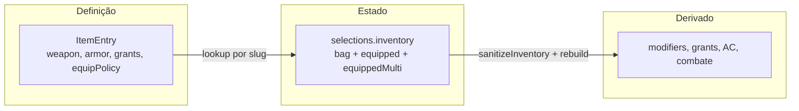

# Inventário e itens — modelo, comportamentos e roadmap

Este documento descreve como **posse**, **equipamento mecânico** e **uso de itens**
funcionam (e devem funcionar) na RPV. Complementa
[`PROJECT_CONTEXT.md`](../PROJECT_CONTEXT.md) (contrato de persistência) e
[`docs/API_INVENTORY.md`](API_INVENTORY.md) (contrato HTTP futuro).

Referência de implementação hoje:

- Estado: [`packages/domain/src/inventory/inventory.types.ts`](../packages/domain/src/inventory/inventory.types.ts)
- Ops + sanitize: [`apps/web/lib/character/inventory.ts`](../apps/web/lib/character/inventory.ts)
- Display (bag vs equipado): [`apps/web/lib/character/inventoryDisplay.ts`](../apps/web/lib/character/inventoryDisplay.ts)
- Grants de item: [`apps/web/lib/character/characterGrants.ts`](../apps/web/lib/character/characterGrants.ts) (`equippedItemSlugs`)
- Definições: [`packages/content/src/item/item.types.ts`](../packages/content/src/item/item.types.ts), overlays em [`itemOverlays.dnd.ts`](../packages/content/src/curation/itemOverlays.dnd.ts)
- Slots D&D: [`equipmentSlots.dnd.ts`](../packages/content/src/curation/equipmentSlots.dnd.ts)
- UI ficha: [`InventoryTab`](../apps/web/components/characters/PlayerSheet/tabs/InventoryTab.tsx)

---

## Princípio central: posse ≠ equipar ≠ usar

| Verbo | Estado | Efeito mecânico | Exemplo |
|-------|--------|-----------------|---------|
| **Possuir** | `bag` | Peso, visibilidade na ficha | Waterskin, corda, rations |
| **Equipar** | `equipped` (single) | Grants, AC, ataques de arma | Armadura, espada, anel mágico |
| **Marcar cosmético** | `equippedMulti.cosmetic` | Só display / roleplay | Roupas, robes |
| **Usar** | `bag` → consome qty | Ação na mesa, efeito pontual | Scroll, poção, holy water |

Na mesa de D&D, scrolls **não são equipados** — são lidos da mochila e consumidos.
Ver [Consumíveis — Use from bag](#consumíveis--use-from-bag-etapa-7-parcial--implementado).

---

## Três camadas



1. **Definição** (`ItemEntry`) — catálogo global por `system` (Open5e + overlays `rpv_*`).
2. **Estado** (`CharacterInventory`) — por personagem: o que possui e o que está vestido/equipado.
3. **Derivado** — recalculado no rebuild; nunca confiado do cliente.

---

## Estado do inventário

```ts
type CharacterInventory = {
  bag: ItemStack[];                      // posse
  equipped: Record<string, string>;       // slots single → slug
  equippedMulti: Record<string, string[]>; // slots multi (cosmetic; usable legado)
};

type ItemStack = {
  slug: string;
  quantity: number;
  provenance?: string;  // loot de grant vs adição manual
};
```

Posse agrega por `slug` (+ `provenance`). Não há teto de quantidade na bag:
`ItemEntry.stackable` é metadado legado do catálogo e **não** limita qty em
sanitize, `setBagQuantity` ou na UI. Qty `0` permanece até **Delete**.
Equipar ainda consome 1 unidade; o mesmo slug ocupa no máximo um slot single.

### O que alimenta mecânica hoje

| Origem | Alimenta grants / modifiers / AC? | Alimenta ataques de inventário? |
|--------|-----------------------------------|----------------------------------|
| `bag` | Não | Não |
| `equipped` (single) | Sim (`equippedItemSlugs`) | Sim, se `item.weapon` em slot de mão |
| `equippedMulti` | Não | Não |

Regra estável: **somente slugs em `equipped` single** entram em `collectGrantSources`.
Itens em `equippedMulti.cosmetic` são roleplay; o multi `usable` existe por legado e
será restrito ou deprecado no refactor de UI.

---

## Comportamentos de item (taxonomia)

| Comportamento | Exemplos SRD | Equipar? | Policy alvo |
|---------------|--------------|----------|-------------|
| Posse passiva | Waterskin, rope, tools, munição | Não | `carried` |
| Cosmético / no corpo | Clothes, robes, anel mundano (signet) | Slot `cosmetic` only | `cosmetic` |
| Empunhar / vestir com efeito | Arma, armadura, escudo, anel mágico | Slots mecânicos | `wieldable`, `shield`, `wearable`, `granted` |
| Uso ativo consumível | Scroll, poção, antitoxin | Não — **Usar** da bag | `carried` + `activation` + `useEffect` |

### Grants em itens

- **Passivo enquanto equipado** — `stat_modifier`, spell grant permanente, etc. Ex.: amuleto +HP.
  Resolvido via `equipped` single → `getItemGrants`.
- **Uso declarado no turno** — `ability` grant com `activation` + `useEffect`
  (ex. `cast_spell`). Não depende de slot; aparece no inventário e no Combat via
  `listConsumableActions` (derivado da bag, **não** de `collectGrantSources`).
  **Canal para consumíveis** (scrolls, poções).

Ver [`packages/content/AGENTS.md`](../packages/content/AGENTS.md) — seção Item equip policy.

---

## ItemEquipPolicy (Etapa 1 — implementado)

Policy data-driven em `@rpv/content` que define **se** e **onde** um item pode equipar.
Implementação: [`itemEquipPolicy.dnd.ts`](../packages/content/src/curation/itemEquipPolicy.dnd.ts).
Helpers exportados: `deriveItemEquipPolicy`, `resolveItemEquipPolicy`,
`getEquipableSlotIds`, `canEquipItem`, `isItemEquippable`.

```ts
type ItemEquipPolicy =
  | "carried"    // só posse — sem slot
  | "cosmetic"   // equippedMulti.cosmetic
  | "wieldable"  // mãos single
  | "shield"     // off-hand shield
  | "wearable"   // slots wearable single
  | "granted";   // wearable + mãos single (itens com grants, sem weapon/armor)
```

Campo opcional em `ItemEntry`: `equipPolicy?: ItemEquipPolicy` — override declarativo
em [`itemOverlays.dnd.ts`](../packages/content/src/curation/itemOverlays.dnd.ts).

### Derivação (resumo)

Ordem de avaliação — primeira match vence:

| Condição | Policy |
|----------|--------|
| `weapon != null` | `wieldable` |
| Escudo (`armor.category === "shield"` ou `category.key === "shield"`) | `shield` |
| Armadura de corpo | `wearable` |
| `grants.length > 0` | `granted` |
| Slug/nome contém `clothes` ou `robes` | `cosmetic` |
| `category.key === "ring"` sem grants | `cosmetic` |
| `category.key === "wondrous-item"` | `wearable` |
| Adventuring gear, tools, munição, veículos, etc. | `carried` |

### Policy → slots permitidos

| Policy | Slots |
|--------|-------|
| `carried` | nenhum |
| `cosmetic` | `cosmetic` (multi) |
| `wieldable` | `melee-main`, `melee-off`, `ranged-main`, `ranged-off` |
| `shield` | `melee-off`, `ranged-off` |
| `wearable` | `helmet`, `cloak`, `breast`, `gloves`, `boots`, `amulet`, `ring`, `ring-2` |
| `granted` | união de wearable + wieldable single |

Override exemplo: itens com grants passivos sem weapon/armor → `granted`.
Ability grants **só** com `useEffect` (consumíveis) **não** implicam `granted`
(`hasEquippableGrants`); category `scroll` deriva `carried`.

---

## Consumíveis — Use from bag (Etapa 7 — implementado)

Piloto original: `rpv_scroll-of-fire-bolt` (`cast_spell`).

Poções (Open5e `/v2/magicitems/`, document `srd-2014`) + gear SRD:

1. Policy `carried` — só bag; sem Equipar (`category.key === "potion"` incluso).
2. Grant `ability` + `activation: { cost: "action", consumeQuantity: 1 }` +
   `useEffect` tipado (`cast_spell` | `heal` | `apply_condition` | `deal_damage`).
3. **Usar** no inventário ou Combat:
   - `cast_spell` → rolagem da magia + `useInventoryItem` (qty−1)
   - `heal` → `RollRequest` heal (N dados + flat) → `applyVitalityChange` self + consume
   - `apply_condition` / `deal_damage` → consume + toast (automação completa futura)
4. Não entra em `stored.grants` como spell/feature permanente.
5. Stacks com provenance consumidos ficam em qty `0` (ocultos no display) para o
   rematerialize não restaurar o loot inicial.

Refresh de poções: `npm run refresh:magic-items -w @rpv/content` depois
`npm run build:catalog -w @rpv/content`.

Helpers: [`consumableActions.ts`](../apps/web/lib/character/consumableActions.ts),
[`useConsumable.ts`](../apps/web/lib/character/useConsumable.ts),
[`itemUse.ts`](../packages/content/src/item/itemUse.ts).

Charges/wands e swap de slot ocupado permanecem pendentes.
---

## Display na ficha (Etapas 4–5 — implementado)

Helpers policy-aware em [`inventoryDisplay.ts`](../apps/web/lib/character/inventoryDisplay.ts)
separam posses, equipamento mecânico e cosmético:

| Helper | Conteúdo |
|--------|----------|
| `listCarriedRows` | Stacks na bag com policy `carried` — painel **Posses** |
| `listStowedEquippableRows` | Todos os equipáveis guardados na bag (conveniência) |
| `listStowedMechanicalRows` / `listStowedCosmeticRows` | Stowed split por policy |
| `listEquipmentColumnRows` | Coluna Gear ou Usable: equipped + stowed mecânico roteado |
| `listCosmeticPanelRows` | Equipped multi + stowed cosmetic — painel **Cosmético** |
| `listBagDisplayRows` | União carried + stowed (legado / testes) |
| `listEquippedRowsByGroup` | Slots preenchidos por grupo (`wearable`, `usable`, `cosmetic`) |
| `resolveMechanicalColumn` | Roteia stowed mecânico → coluna Gear vs Usable |

**Nomenclatura:** `listCarriedRows` (display) ≠ `listCarriedQuantities` (peso em
[`inventoryWeight.ts`](../apps/web/lib/character/inventoryWeight.ts)) — o helper de
peso inclui bag **e** equipado; o de display lista só policy `carried` na bag.

### Layout da aba (Etapa 5)

Ordem: resumo (peso/moeda/misc) → **Equipamento** → **Posses** → **Cosmético**.

| Painel | Componente | Dados |
|--------|------------|-------|
| Equipamento | `InventoryEquipmentPanel` | Colunas Gear + Usable (`listEquipmentColumnRows`) |
| Posses | `InventoryPossessionsPanel` | `listCarriedRows` + filtros categoria |
| Cosmético | `InventoryCosmeticPanel` | `listCosmeticPanelRows` |

Regras:

- Stowed mecânico (ex. amuleto na bag) aparece no painel **Equipamento**, na coluna
  adequada (`resolveMechanicalColumn`).
- Stowed cosmetic (ex. clothes) aparece no painel **Cosmético**.
- Filtros categoria aplicam-se **só** ao painel Posses.
- Dedup Etapa 4 preservado: slug equipado não repete como stowed.
- Legacy `equippedMulti.usable` omitido do display mecânico.
- `countMiscItems` conta só posses (`listCarriedRows`) na categoria misc.

---

## Pré-Etapa 6 — auditoria (concluída)

Limpeza antes do picker de catálogo (Etapa 6):

| Item | Ação |
|------|------|
| `listInventoryRows` | Removido (alias deprecated de `listBagDisplayRows`) |
| `listBagDisplayRows` | Mantido — conveniência para testes e callers |
| i18n `itemsTitle` / `equippedTitle` | Removidos — UI usa `equipmentTitle`, `possessionsTitle`, `cosmeticTitle` |
| Tab **Quest items** | Removida da toolbar — `resolveItemFilterCategory` nunca retorna `"quest"`; reintroduzir com categoria de catálogo |

### Criação de personagem

Loot inicial (classe, background, starting equipment) materializa **somente na bag**
(`provenance` em stacks concedidos). `equipped` fica vazio; **grants de item** só
após equipar na ficha. O wizard usa `useGrantPickSanitizer` para rematerializar bag
e moeda quando picks de starting equipment mudam.

### Camadas de teste (inventário / criação)

| Camada | Arquivo(s) | Foco |
|--------|------------|------|
| Domain | `packages/domain` — `emptyInventory` | Primitivos de estado |
| Content | `packages/content` — `inventoryGrants` | Materialização de grants |
| Mutations | `inventory.test.ts` | equip, sanitize, bag ops |
| Display | `inventoryDisplay.test.ts` | row helpers, filtros em Posses |
| Build | `buildCharacter.test.ts`, `materializeInventoryGrants.test.ts` | pipeline create → stored |
| Sanitize | `sanitizeStartingMaterialization.test.ts`, `useGrantPickSanitizer.test.ts` | branch equipment ↔ gold |
| UI ficha | `inventoryTab.test.tsx` | três painéis, equip actions, busca, add-item modal |
| UI legado | `characterCardInventory.test.tsx` | carousel (fora do refactor Etapa 5) |

Overlap entre camadas é intencional; duplicatas idênticas foram podadas (provenance
dedup mantido em `buildCharacter.test.ts`).

**Próximo passo:** polish Etapa 7 (swap de slot ocupado); charges/wands; automação `apply_condition` / `deal_damage`.

---

## Estado atual vs alvo (implementação)

| Aspecto | Hoje (piloto) | Alvo (roadmap) |
|---------|---------------|----------------|
| Qualquer item em qualquer slot | Não — `sanitizeInventory` + `equipItem` usam `canEquipItem` | Policy + sanitize rejeita mismatch |
| Waterskin equipável | Não — sem botão Equip (policy `carried`) | `carried` — só Posses |
| Roupas | Só slot `cosmetic` no menu | `cosmetic` |
| Scroll | Usar da bag + consumir qty ✅ | — |
| Poção de cura | Usar da bag + heal roll → HP ✅ | — |
| Antitoxin / holy water / alchemist's fire | Usar + consume + toast (efeito na mesa) ✅ | Automação completa depois |
| Adicionar item manual | Picker do catálogo → `addToBag` (qty 1) ✅ | — |
| Busca nas Posses | Texto + filtros de categoria ✅ | — |
| Layout da aba | Três painéis: Equipamento / Posses / Cosmético | — |
| Homebrew publicado | Fora de escopo | Mesmo `ItemEntry` via repositório |

---

## Roadmap de implementação (sequencial)

Cada etapa fecha com testes antes da próxima.

| Etapa | Escopo | Pacotes / arquivos principais |
|-------|--------|-------------------------------|
| **1** | `ItemEquipPolicy` + `canEquipItem` ✅ | `packages/content` — `itemEquipPolicy.dnd.ts` |
| **2** | `sanitizeInventory` + `equipItem` respeitam policy ✅ | `apps/web/lib/character/inventory.ts` |
| **3** | UI: esconder Equipar para `carried`; filtrar slots ✅ | `InventoryEquipMenu`, `InventoryItemContentCard` |
| **4** | Display: `listCarriedRows` vs equipados vs cosmético ✅ | `inventoryDisplay.ts`, `InventoryTab` |
| **5** | Layout aba Inventário (Equipamento / Posses / Cosmético) ✅ | `InventoryTab`, painéis |
| **6** | Adicionar item do catálogo + busca Posses ✅ | `InventoryToolbar`, `InventoryAddItemModal` |
| **7** | Consumíveis **Usar** (scroll + potions heal + stubs gear) ✅; polish: swap de slot ocupado | grants + `useEffect`, qty |

Homebrew compartilhável fica **fora** deste roadmap — mesmo `ItemEntry` quando existir.

---

## Referências externas (produto)

Ferramentas maduras separam equipamento mecânico de posse passiva:

- **D&D Beyond** — Equipment (toggle equip) vs Other Possessions (sem toggle).
- **Roll20 (2024)** — Equipment / Attunement / Other Possessions.
- **Foundry** — toggle equip só em tipos com propriedade `equipped` no schema.

A RPV alinha-se a essa distinção: gear mundano em **Posses**; armadura/arma/mágico
vestível em **Equipamento ativo**.

---

## Relação com outros documentos

| Documento | Conteúdo |
|-----------|----------|
| [`PROJECT_CONTEXT.md`](../PROJECT_CONTEXT.md) | Contrato resumido, pipeline, starting equipment |
| [`docs/API_INVENTORY.md`](API_INVENTORY.md) | HTTP PATCH, sanitize, exemplos |
| [`packages/content/AGENTS.md`](../packages/content/AGENTS.md) | Authoring de `ItemEntry`, policy, checklists |
| [`docs/FICHA_JOGADOR.md`](FICHA_JOGADOR.md) | Aba Mochila na Player Sheet |
