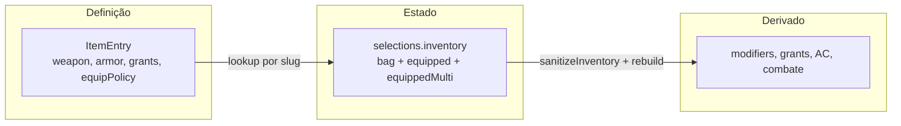

# Inventário e itens — modelo, comportamentos e roadmap

Este documento descreve como **posse**, **equipamento mecânico** e **uso de itens**
funcionam (e devem funcionar) na RPV. Complementa
[`PROJECT_CONTEXT.md`](../PROJECT_CONTEXT.md) (contrato de persistência) e
[`docs/API_INVENTORY.md`](API_INVENTORY.md) (contrato HTTP futuro).

Referência de implementação hoje:

- Estado: [`packages/domain/src/inventory/inventory.types.ts`](../packages/domain/src/inventory/inventory.types.ts)
- Ops + sanitize: [`apps/web/lib/character/inventory.ts`](../apps/web/lib/character/inventory.ts)
- Grants de item: [`apps/web/lib/character/characterGrants.ts`](../apps/web/lib/character/characterGrants.ts) (`equippedItemSlugs`)
- Definições: [`packages/content/src/item/item.types.ts`](../packages/content/src/item/item.types.ts), overlays em [`itemOverlays.dnd.ts`](../packages/content/src/curation/itemOverlays.dnd.ts)
- Slots D&D: [`equipmentSlots.dnd.ts`](../packages/content/src/curation/equipmentSlots.dnd.ts)
- UI ficha: [`InventoryTab`](../apps/web/components/characters/PlayerSheet/tabs/InventoryTab.tsx)

---

## Princípio central: posse ≠ equipar ≠ usar

| Verbo | Estado | Efeito mecânico | Exemplo |
|-------|--------|-----------------|---------|
| **Possuir** | `bag` | Peso, visibilidade na ficha | Waterskin, corda, rations |
| **Equipar** | `equipped` (single) | Grants, AC, ataques de arma | Armadura, espada, anel mágico |
| **Marcar cosmético** | `equippedMulti.cosmetic` | Só display / roleplay | Roupas, robes |
| **Usar** (futuro) | `bag` → consome qty | Ação na mesa, efeito pontual | Scroll, poção, holy water |

Na mesa de D&D, scrolls **não são equipados** — são lidos da mochila e consumidos.
A aplicação ainda não modela esse fluxo; ver [Limitação do piloto — scroll](#limitação-do-piloto--scroll).

---

## Três camadas



1. **Definição** (`ItemEntry`) — catálogo global por `system` (Open5e + overlays `rpv_*`).
2. **Estado** (`CharacterInventory`) — por personagem: o que possui e o que está vestido/equipado.
3. **Derivado** — recalculado no rebuild; nunca confiado do cliente.

---

## Estado do inventário

```ts
type CharacterInventory = {
  bag: ItemStack[];                      // posse
  equipped: Record<string, string>;       // slots single → slug
  equippedMulti: Record<string, string[]>; // slots multi (cosmetic; usable legado)
};

type ItemStack = {
  slug: string;
  quantity: number;
  provenance?: string;  // loot de grant vs adição manual
};
```

### O que alimenta mecânica hoje

| Origem | Alimenta grants / modifiers / AC? | Alimenta ataques de inventário? |
|--------|-----------------------------------|----------------------------------|
| `bag` | Não | Não |
| `equipped` (single) | Sim (`equippedItemSlugs`) | Sim, se `item.weapon` em slot de mão |
| `equippedMulti` | Não | Não |

Regra estável: **somente slugs em `equipped` single** entram em `collectGrantSources`.
Itens em `equippedMulti.cosmetic` são roleplay; o multi `usable` existe por legado e
será restrito ou deprecado no refactor de UI.

---

## Comportamentos de item (taxonomia)

| Comportamento | Exemplos SRD | Equipar? | Policy alvo |
|---------------|--------------|----------|-------------|
| Posse passiva | Waterskin, rope, tools, munição | Não | `carried` |
| Cosmético / no corpo | Clothes, robes, anel mundano (signet) | Slot `cosmetic` only | `cosmetic` |
| Empunhar / vestir com efeito | Arma, armadura, escudo, anel mágico | Slots mecânicos | `wieldable`, `shield`, `wearable`, `granted` |
| Uso ativo consumível | Scroll, poção, antitoxin | Não — **Usar** da bag (futuro) | `carried` + `activation` |

### Grants em itens

- **Passivo enquanto equipado** — `stat_modifier`, spell grant permanente, etc. Ex.: amuleto +HP.
  Resolvido via `equipped` single → `getItemGrants`.
- **Uso declarado no turno** — `ability` grant com `activation` (`action`, `bonus`, …).
  Não deve depender de slot de mão; aparece no catálogo de ações/combate.
  **Canal correto para consumíveis** (scrolls, poções).

Ver [`packages/content/AGENTS.md`](../packages/content/AGENTS.md) — seção Item equip policy.

---

## ItemEquipPolicy (Etapa 1 — implementado)

Policy data-driven em `@rpv/content` que define **se** e **onde** um item pode equipar.
Implementação: [`itemEquipPolicy.dnd.ts`](../packages/content/src/curation/itemEquipPolicy.dnd.ts).
Helpers exportados: `deriveItemEquipPolicy`, `resolveItemEquipPolicy`,
`getEquipableSlotIds`, `canEquipItem`, `isItemEquippable`.

```ts
type ItemEquipPolicy =
  | "carried"    // só posse — sem slot
  | "cosmetic"   // equippedMulti.cosmetic
  | "wieldable"  // mãos single
  | "shield"     // off-hand shield
  | "wearable"   // slots wearable single
  | "granted";   // wearable + mãos single (itens com grants, sem weapon/armor)
```

Campo opcional em `ItemEntry`: `equipPolicy?: ItemEquipPolicy` — override declarativo
em [`itemOverlays.dnd.ts`](../packages/content/src/curation/itemOverlays.dnd.ts).

### Derivação (resumo)

Ordem de avaliação — primeira match vence:

| Condição | Policy |
|----------|--------|
| `weapon != null` | `wieldable` |
| Escudo (`armor.category === "shield"` ou `category.key === "shield"`) | `shield` |
| Armadura de corpo | `wearable` |
| `grants.length > 0` | `granted` |
| Slug/nome contém `clothes` ou `robes` | `cosmetic` |
| `category.key === "ring"` sem grants | `cosmetic` |
| `category.key === "wondrous-item"` | `wearable` |
| Adventuring gear, tools, munição, veículos, etc. | `carried` |

### Policy → slots permitidos

| Policy | Slots |
|--------|-------|
| `carried` | nenhum |
| `cosmetic` | `cosmetic` (multi) |
| `wieldable` | `melee-main`, `melee-off`, `ranged-main`, `ranged-off` |
| `shield` | `melee-off`, `ranged-off` |
| `wearable` | `helmet`, `cloak`, `breast`, `gloves`, `boots`, `amulet`, `ring`, `ring-2` |
| `granted` | união de wearable + wieldable single |

Override exemplo: `rpv_scroll-of-fire-bolt` → `equipPolicy: "wieldable"` (piloto;
ver limitação abaixo).

---

## Limitação do piloto — scroll

`rpv_scroll-of-fire-bolt` usa `grantType: "spell"` **sem** `activation`. Enquanto
está em um slot `equipped` single, o personagem ganha o spell grant (aparece na aba
Combate). Isso é um **atalho de teste**, não a regra de mesa.

Comportamento alvo (etapa futura — consumíveis):

1. Policy `carried` — scroll fica só na bag.
2. Grant `ability` + `activation: { cost: "action" }` (ou metadado de spell + consumo).
3. Botão **Usar** no card do inventário → rolagem + `removeFromBag(slug, 1)`.
4. Sem equipar.

Até lá, o scroll piloto continua exigindo equip para o spell grant aparecer.

---

## Estado atual vs alvo (implementação)

| Aspecto | Hoje (piloto) | Alvo (roadmap) |
|---------|---------------|----------------|
| Qualquer item em qualquer slot | Não — `sanitizeInventory` + `equipItem` usam `canEquipItem` | Policy + sanitize rejeita mismatch |
| Waterskin equipável | Não — sem botão Equip (policy `carried`) | `carried` — só Posses |
| Roupas | Só slot `cosmetic` no menu | `cosmetic` |
| Scroll | Equip + spell grant passivo | Usar da bag + consumir (futuro) |
| Adicionar item manual | Stub na Player Sheet | Picker do catálogo → `addToBag` |
| Layout da aba | Equipados + grid único | Equipamento ativo / Posses / Cosmético |
| Homebrew publicado | Fora de escopo | Mesmo `ItemEntry` via repositório |

---

## Roadmap de implementação (sequencial)

Cada etapa fecha com testes antes da próxima.

| Etapa | Escopo | Pacotes / arquivos principais |
|-------|--------|-------------------------------|
| **1** | `ItemEquipPolicy` + `canEquipItem` ✅ | `packages/content` — `itemEquipPolicy.dnd.ts` |
| **2** | `sanitizeInventory` + `equipItem` respeitam policy ✅ | `apps/web/lib/character/inventory.ts` |
| **3** | UI: esconder Equipar para `carried`; filtrar slots ✅ | `InventoryEquipMenu`, `InventoryItemContentCard` |
| **4** | Display: `listCarriedRows` vs equipados vs cosmético | `inventoryDisplay.ts` |
| **5** | Layout aba Inventário (Posses / Equipamento / Cosmético) | `InventoryTab`, painéis |
| **6** | Adicionar item do catálogo | `InventoryToolbar` + modal picker |
| **7** | Polish: swap de slot ocupado; consumíveis com **Usar** | grants + `activation`, qty |

Homebrew compartilhável fica **fora** deste roadmap — mesmo `ItemEntry` quando existir.

---

## Referências externas (produto)

Ferramentas maduras separam equipamento mecânico de posse passiva:

- **D&D Beyond** — Equipment (toggle equip) vs Other Possessions (sem toggle).
- **Roll20 (2024)** — Equipment / Attunement / Other Possessions.
- **Foundry** — toggle equip só em tipos com propriedade `equipped` no schema.

A RPV alinha-se a essa distinção: gear mundano em **Posses**; armadura/arma/mágico
vestível em **Equipamento ativo**.

---

## Relação com outros documentos

| Documento | Conteúdo |
|-----------|----------|
| [`PROJECT_CONTEXT.md`](../PROJECT_CONTEXT.md) | Contrato resumido, pipeline, starting equipment |
| [`docs/API_INVENTORY.md`](API_INVENTORY.md) | HTTP PATCH, sanitize, exemplos |
| [`packages/content/AGENTS.md`](../packages/content/AGENTS.md) | Authoring de `ItemEntry`, policy, checklists |
| [`docs/FICHA_JOGADOR.md`](FICHA_JOGADOR.md) | Aba Mochila na Player Sheet |
